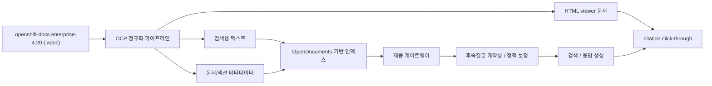

# OCP 운영 가이드 챗봇

이 저장소는 **공식 OpenShift Container Platform 문서를 기반 데이터로 사용하는 OCP 운영 가이드 챗봇**을 만드는 프로젝트다.

핵심은 단순한 문서 검색기나 데모용 RAG가 아니라,

- 폐쇄망/운영 환경에서 실제로 쓸 수 있고
- 한국어 질문에 정확하게 답하고
- 공식 문서 근거를 클릭 가능한 citation으로 보여주며
- **5턴 이상 멀티턴 문맥을 안정적으로 유지하는**
- **직접 설계한** OCP 운영 도우미 챗봇을 만드는 것이다.

## 이 프로젝트가 정확히 무엇인가

이 프로젝트는 아래 3가지를 결합한 제품 레이어다.

1. **데이터 원천**
   - 공식 OCP 문서 원천: `https://github.com/openshift/openshift-docs/tree/enterprise-4.20`
2. **파이프라인 기준**
   - `https://github.com/joungminsung/OpenDocuments`
   - 이 저장소는 OpenDocuments의 인덱싱/런타임 파이프라인 방향을 따른다.
3. **이 저장소의 고유 책임**
   - OCP 전용 정규화 파이프라인
   - OCP 운영 질문에 맞춘 retrieval / answer policy
   - 자체 게이트웨이 / 브리지 / 세션 메모리 / citation viewer
   - 폐쇄망 반입 / 활성화 / 롤백 운영 흐름
   - 멀티턴 5턴 이상 검증과 운영 품질 평가 체계

즉, **OpenDocuments를 그대로 포장하는 프로젝트가 아니라**, 그 파이프라인을 기준선으로 삼아 **OCP 운영 가이드 챗봇을 직접 설계하고 완성하는 프로젝트**다.

## 중요하게 선을 그어야 하는 것

- 이 프로젝트는 LangSmith 같은 완성형 운영/평가 제품에 의존해 “대충 붙이는” 방향이 아니다.
- 멀티턴, grounded answer, citation, 운영 흐름은 **직접 설계하고 직접 검증**해야 한다.
- 핵심 평가 과제는 단순 연결 성공이 아니라 다음 3가지다.
  1. **정확한 일처리** — 공식 문서 근거에 맞는 답변과 보수적 응답
  2. **설계력** — 멀티턴 메모리, follow-up rewrite, 정책, 운영 흐름을 제품 구조로 설계
  3. **검증력** — 5턴 이상 멀티턴, retrieval, red-team, runtime path, activation/rollback까지 증거로 입증

## 현재 기술 기준

현재 이 저장소가 고정 기준으로 삼는 기술 축은 다음과 같다.

- **생성 모델**: `Qwen/Qwen3.5-9B`
- **임베딩 모델**: `BAAI/bge-m3`
- **임베딩 차원**: `1024`
- **평가 기준 문서 버전**: `openshift-docs` `enterprise-4.20`
- **평가 기준 소스 프로필**: `ocp-4.20-balanced`

왜 이 구성이 중요한가:

- `Qwen/Qwen3.5-9B`는 현재 회사 제공 런타임 경로에서 사용하는 생성 모델 기준이다.
- `BAAI/bge-m3`는 한국어 질문과 영어 공식 문서를 함께 다루는 멀티링구얼 임베딩 기준이다.
- `enterprise-4.20`은 현재 canonical evaluation의 문서 기준선이다.
- 현재 widened validation runtime/index 상태와 평가 기준선은 완전히 같은 개념이 아니며, 최신 활성 상태는 Stage 15 증거 문서를 함께 봐야 한다.

## 제품 목표

이 프로젝트의 제품 목표는 다음과 같다.

- 한국어 운영 질문을 받을 수 있어야 한다.
- 답변은 **공식 OCP 문서 근거**에 기반해야 한다.
- 답변에는 **클릭 가능한 citation**이 포함되어야 한다.
- citation 클릭 시 내부 HTML viewer가 정확한 문서/섹션을 열어야 한다.
- follow-up 질문에서 앞선 문맥과 문서 대상을 유지해야 한다.
- **5턴 이상 멀티턴 시나리오**에서도 grounded behavior가 유지되어야 한다.
- 폐쇄망 반입, 인덱스 생성, 활성화, 스모크, 롤백 흐름까지 운영 가능한 구조여야 한다.

## 시스템 개요

이 프로젝트는 크게 4개 계층으로 구성된다.

### 1. 문서 수집/정규화 계층

- canonical evaluation 기준으로는 `openshift-docs` `enterprise-4.20` 원본 `.adoc` 문서를 입력으로 사용한다.
- 검색용 텍스트, HTML viewer 문서, 문서/섹션 메타데이터를 생성한다.
- citation click-through에 필요한 viewer 경로와 section anchor 정보를 만든다.

관련 구현:

- `ingest/normalize_openshift_docs.py`
- `configs/source-profiles.yaml`
- `configs/active-source-profile.yaml`

### 2. 검색/RAG 계층

- OpenDocuments 파이프라인을 기준으로 문서를 인덱싱한다.
- retrieval 결과를 OCP 운영 질문에 맞게 보정한다.
- source/category/path term/follow-up memory를 반영한다.

관련 구현:

- `app/ocp_policy.py`
- `configs/rag-policy.yaml`
- `app/multiturn_memory.py`

### 3. 런타임 계층

- 사용자 요청은 제품 게이트웨이로 들어온다.
- OpenDocuments 브리지와 HTTP runtime을 통해 응답이 생성된다.
- citation 정리, 세션 연속성, viewer 노출은 이 제품 레이어가 책임진다.

관련 구현:

- `app/ocp_runtime_gateway.py`
- `app/opendocuments_openai_bridge.py`
- `app/runtime_gateway_support.py`
- `app/runtime_source_index.py`
- `deployment/start_runtime_stack.py`

### 4. 운영 계층

- 승인된 문서 번들 생성
- inbound staging
- reindex
- activation
- smoke
- rollback

관련 구현:

- `deployment/build_outbound_bundle.py`
- `deployment/reindex_staged_bundle.py`
- `deployment/activate_index.py`
- `deployment/rollback_index.py`

## 파이프라인 요약



## 런타임 기준

현재 로컬 실행 기본 포트는 다음과 같다.

- `8000`: 제품 게이트웨이 / UI
- `18101`: OpenAI 호환 브리지
- `18102`: OpenDocuments 런타임

운영자 기본 접속 주소:

- `http://127.0.0.1:8000`

## 실행 예시

### 1. 환경 변수 준비

민감 정보는 코드에 하드코딩하지 않고 `.env`로 관리한다.

```env
OD_SERVER_BASE_URL=http://127.0.0.1:18102
LLM_ENDPOINT=company
LLM_EP_COMPANY_URL=http://...
LLM_EP_COMPANY_MODEL=Qwen/Qwen3.5-9B
OD_EMBEDDING_MODEL=BAAI/bge-m3
OD_EMBEDDING_DIMENSIONS=1024
```

### 2. 런타임 기동

```powershell
powershell -ExecutionPolicy Bypass -File deployment/start_local_runtime.ps1
```

또는 증거를 남기며 직접 기동:

```bash
python deployment/start_runtime_stack.py
```

### 3. 종료

```powershell
powershell -ExecutionPolicy Bypass -File deployment/stop_local_runtime.ps1
```

## 현재 상태

이 저장소는 더 이상 막연한 프로토타입 설명 단계가 아니다. 현재는 다음 기준이 이미 확보된 상태다.

- `enterprise-4.20` 기반 canonical evaluation 기준선 확보
- `Qwen/Qwen3.5-9B` + `BAAI/bge-m3` 기준 runtime lock
- OpenDocuments 기반 live runtime serving path 검증
- citation viewer click-through 검증
- Stage 11 refresh / activate / rollback 흐름 검증
- Stage 14 one-command runtime launch 검증
- Stage 15 widened validation corpus(`main` 기반 `s15c-core`) 활성화 검증 완료
- multiturn replay 통과 기록 보유

다만 제품 완성도 측면에서 아직 계속 강화해야 할 핵심 영역이 있다.

- **5턴 이상 멀티턴 안정성 강화**
- **운영 질문 기준 retrieval / grounded answer 정확도 강화**
- **정책/메모리/세션 설계의 일관성 강화**
- **운영자 관점의 재현 가능성과 설명 가능성 강화**

## 이 프로젝트를 평가할 때 봐야 하는 것

이 프로젝트는 아래 항목으로 평가해야 한다.

### 1. 정확한 일처리

- 질문 의도에 맞는 문서군으로 들어가는가
- 보수적으로 답해야 할 때 추측하지 않는가
- citation이 실제 근거 문서/섹션으로 이어지는가

### 2. 멀티턴 설계력

- 5턴 이상 follow-up에서 문맥이 유지되는가
- 이전 문서/버전/주제를 올바르게 이어받는가
- 세션 메모리와 rewrite가 runtime path에서 실제로 동작하는가

### 3. 운영 구조의 완성도

- ingestion → index → serve → activate → rollback 흐름이 끊기지 않는가
- 폐쇄망 환경에서 재현 가능한가
- 설정/정책/검증 문서가 일관되게 이어지는가

## 다음 발전 방향

이 프로젝트는 앞으로 아래 순서로 발전해야 한다.

1. **멀티턴 5턴+ 안정화**
   - follow-up rewrite, session memory, topic/version continuity를 강화
2. **운영 질문 정확도 강화**
   - retrieval 보정과 grounded answer policy를 운영 질문 중심으로 고도화
3. **직접 설계한 평가 체계 강화**
   - off-the-shelf 제품 의존 대신, retrieval/multiturn/red-team/runtime/rollback을 저장소 안에서 직접 검증
4. **운영자 사용성 강화**
   - launch, smoke, evidence, rollback 흐름을 더 짧고 명확하게 만듦
5. **release-grade hardening**
   - target minor 고정, corpus 확장, widened validation 회귀 강화, 운영자용 문서/런북 정리

## 어디부터 보면 좋은가

1. `README.md`
2. `docs/v2/repository-map.md`
3. `docs/v2/project-plan-summary.md`
4. `docs/v2/stage12-live-runtime-report.md`
5. `docs/v2/stage14-runtime-launch.md`

## 참고

- 공식 OCP 데이터 원천: https://github.com/openshift/openshift-docs/tree/enterprise-4.20
- 파이프라인 기준: https://github.com/joungminsung/OpenDocuments
