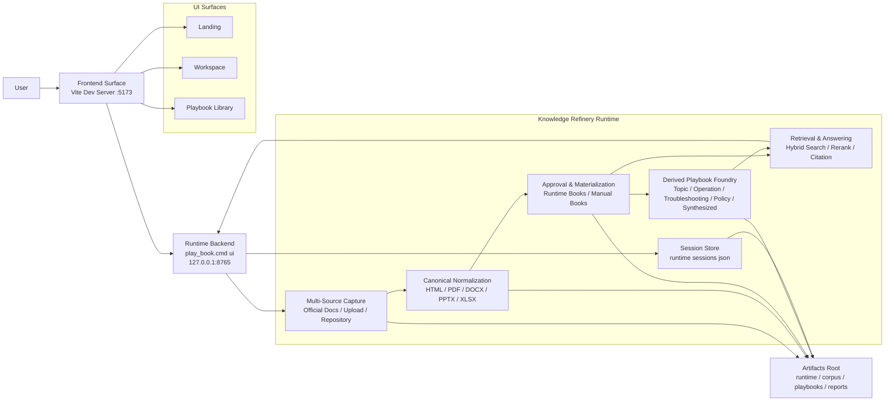

# Play Book Studio

> 테스트 서버: [http://localhost:5173/](http://localhost:5173/) | Runtime API: [http://127.0.0.1:8765/](http://127.0.0.1:8765/)

Play Book Studio는 공식 문서, 운영 절차서, 벤더 가이드, 사내 runbook을 같은 구조로 정리해서 `읽는 문서`, `실행용 플레이북`, `근거 기반 답변`으로 이어 주는 플레이북 플랫폼이다.

수집된 문서는 정규화 과정을 거쳐 `Manual Book`으로 materialize되고, 여기서 `Topic`, `Operation`, `Troubleshooting`, `Policy`, `Synthesized` 계열의 `Derived Playbook`이 생성된다. 사용자는 `Workspace`에서 근거 기반 챗봇과 문서 뷰어로 이를 탐색하고, `Playbook Library`에서 런타임 북과 파생 자산을 확인할 수 있다.

## Current Scope

- 현재 기본 validated pack은 `OpenShift 4.20` 이다.
- customer document intake 경로가 연결돼 있다.
- repository source staging 경로가 연결돼 있다.
- 주요 산출물은 `Manual Book`, `Derived Playbook Family`, `grounded answer surface` 다.
- frontend는 `5173`, backend runtime은 `8765`에서 동작한다.

현재 범위와 품질 기준은 [Q1_8_PRODUCT_CONTRACT.md](/C:/Users/soulu/cywell/ocp-play-studio/ocp-play-studio/Q1_8_PRODUCT_CONTRACT.md:1), [OWNER_SCENARIO_SCORECARD.yaml](/C:/Users/soulu/cywell/ocp-play-studio/ocp-play-studio/OWNER_SCENARIO_SCORECARD.yaml:1)을 본다.

## Product Surfaces

- `Landing`
  제품 포지셔닝, Data Foundry Pipeline, 제품 표면 설명
- `Workspace`
  근거 기반 챗봇, 세션 히스토리, source preview, customer-pack 작업
- `Playbook Library`
  runtime books, derived assets, repository search/favorites, control tower 메트릭
- `Runtime Backend`
  ingestion, retrieval, session persistence, viewer serving, repository search API

## Local URLs

- Frontend dev server: [http://localhost:5173/](http://localhost:5173/)
- Workspace: [http://localhost:5173/workspace](http://localhost:5173/workspace)
- Playbook Library: [http://localhost:5173/playbook-library](http://localhost:5173/playbook-library)
- Backend runtime: [http://127.0.0.1:8765/](http://127.0.0.1:8765/)

Vite dev server는 `5173`에서 떠 있고, 아래 경로를 `8765` runtime으로 프록시한다.

- `/api`
- `/docs`
- `/playbooks`
- `/data-situation-room`

프록시 설정은 [vite.config.ts](/C:/Users/soulu/cywell/ocp-play-studio/ocp-play-studio/presentation-ui/vite.config.ts:1)를 본다.

## System Architecture



## Data Foundry Pipeline

1. `Multi-Source Capture`
   공식 문서, 업로드 파일, 선택한 레포지토리 문서를 수집하고 원본과 출처를 고정한다.
2. `Canonical Normalization`
   HTML, PDF, DOCX, PPTX, XLSX를 정규 섹션으로 바꾸고 명령어, 표, 절차, 앵커, provenance를 추출한다.
3. `Approval & Materialization`
   품질 게이트를 통과한 문서만 Approved Runtime Book으로 승격하고 viewer/library 자산으로 반영한다.
4. `Derived Playbook Foundry`
   승격된 북을 Topic, Operation, Troubleshooting, Policy, Synthesized Playbook으로 파생한다.

## Current Runtime Capabilities

- `Grounded chat`
  answer -> source -> version -> anchor 추적이 가능한 RAG 답변
- `Session persistence`
  세션 목록 조회, 세션 재개, 단건 삭제, 전체 삭제
- `Customer document intake`
  upload -> capture -> normalize -> viewer/library 반영
- `Repository source staging`
  GitHub repository docs-first 검색, favorites 저장
- `Viewer serving`
  `/docs/*`, `/playbooks/*` 경로를 backend에서 직접 서빙

## Key APIs

- `POST /api/chat`
- `GET /api/sessions`
- `GET /api/sessions/load`
- `POST /api/sessions/delete`
- `POST /api/sessions/delete-all`
- `POST /api/customer-packs/upload-draft`
- `POST /api/customer-packs/capture`
- `POST /api/customer-packs/normalize`
- `POST /api/customer-packs/ingest`
- `GET /api/repositories/search`
- `GET /api/repositories/favorites`
- `POST /api/repositories/favorites`
- `POST /api/repositories/favorites/remove`
- `GET /api/data-control-room`

핵심 런타임 라우트는 [server.py](/C:/Users/soulu/cywell/ocp-play-studio/ocp-play-studio/src/play_book_studio/app/server.py:1), route handler는 [server_routes.py](/C:/Users/soulu/cywell/ocp-play-studio/ocp-play-studio/src/play_book_studio/app/server_routes.py:1)를 본다.

## Local Run

### 1. Backend runtime

```powershell
play_book.cmd ui --host 127.0.0.1 --port 8765 --no-browser
```

기본 포트는 `8765` 다. CLI 정의는 [cli.py](/C:/Users/soulu/cywell/ocp-play-studio/ocp-play-studio/src/play_book_studio/cli.py:37)를 본다.

### 2. Frontend dev server

```powershell
Set-Location presentation-ui
npm install
npm run dev
```

기본 dev 주소는 `http://localhost:5173` 이다.

### 3. Single query / eval / runtime report

```powershell
play_book.cmd ask --query "etcd 백업은 어떻게 하나?"
play_book.cmd eval
play_book.cmd runtime
```

## Tech Stack


아래는 현재 저장소에 선언된 의존성을 기준으로 정리한 `5개 카드형 스택 맵`이다.

### 1. Backend Core

> `Python 3.11+` 기반 런타임과 기본 서버/검증 계층

| Package / Component | Version Spec | Role |
|---|---|---|
| `Python stdlib http.server` | built-in | local backend runtime |
| `requests` | `>=2.31` | HTTP client |
| `jsonschema` | `>=4.26` | schema validation |
| `setuptools` | `>=68` | Python build backend |
| `wheel` | `latest` | wheel packaging |

### 2. Frontend App

> `5173`에서 구동되는 UI surface와 interaction 계층

| Package | Version Spec | Role |
|---|---|---|
| `react` | `^19.2.4` | UI runtime |
| `react-dom` | `^19.2.4` | DOM renderer |
| `react-router-dom` | `^7.14.0` | routing |
| `@types/react-router-dom` | `^5.3.3` | router typings used in project |
| `react-resizable-panels` | `^4.10.0` | resizable / collapsible workspace panels |
| `gsap` | `^3.14.2` | motion and scroll animation |
| `lucide-react` | `^1.8.0` | icons |
| `react-markdown` | `^10.1.0` | markdown rendering |
| `clsx` | `^2.1.1` | conditional class composition |
| `lenis` | `^1.3.21` | smooth scroll behavior |

### 3. AI / Retrieval

> 답변 생성 전에 recall, rerank, evaluation을 담당하는 모델 계층

| Package / Component | Version Spec | Role |
|---|---|---|
| `sentence-transformers` | `==5.3.0` | embeddings / reranker model runtime |
| `onnxruntime` | `>=1.20` | local inference runtime |
| `ragas` | `>=0.4.3` | answer / RAG evaluation |
| `datasets` | `>=4.8.4` | eval dataset handling |
| `Qdrant integration` | runtime component | retrieval backend path |
| `Neo4j graph runtime` | runtime component | graph sidecar integration |

### 4. Document Processing

> 다중 포맷 문서를 canonical section으로 바꾸는 제련 계층

| Package / Component | Version Spec | Role |
|---|---|---|
| `markitdown[docx,pdf,pptx,xlsx]` | `>=0.1.5` | multi-format document to markdown conversion |
| `docling` | `>=2.84.0` | document parsing / OCR pipeline |
| `beautifulsoup4` | `>=4.12` | HTML parsing |
| `pypdf` | `>=6.0` | PDF text extraction |
| `pypdfium2` | `>=4.30` | PDF rendering support |
| `rapidocr` | `>=3.7.0` | OCR fallback |

### 5. Infra / Tooling

> 개발, 번들링, 저장, 프록시, 운영에 필요한 기반 계층

| Package / Component | Version Spec | Role |
|---|---|---|
| `vite` | `^8.0.4` | dev server / bundler |
| `@vitejs/plugin-react` | `^6.0.1` | React support for Vite |
| `typescript` | `~6.0.2` | static typing |
| `@types/node` | `^24.12.2` | Node typings |
| `@types/react` | `^19.2.14` | React typings |
| `@types/react-dom` | `^19.2.3` | React DOM typings |
| `eslint` | `^9.39.4` | lint runner |
| `@eslint/js` | `^9.39.4` | ESLint base config |
| `typescript-eslint` | `^8.58.0` | TypeScript lint integration |
| `eslint-plugin-react-hooks` | `^7.0.1` | React hooks lint rules |
| `eslint-plugin-react-refresh` | `^0.5.2` | React refresh lint rules |
| `globals` | `^17.4.0` | standard global variable sets |
| `Vite proxy` | runtime component | `5173 -> 8765` API/docs/playbooks forwarding |
| `JSON session snapshots` | runtime component | chat history persistence |
| `artifacts root` | runtime component | runtime / corpus / playbooks / reports storage |

의존성 선언 원본은 [pyproject.toml](/C:/Users/soulu/cywell/ocp-play-studio/ocp-play-studio/pyproject.toml:1) 과 [package.json](/C:/Users/soulu/cywell/ocp-play-studio/ocp-play-studio/presentation-ui/package.json:1)을 본다.

## Active Rule Set

현재 프로젝트 규칙은 아래 문서만 소유한다.

- [AGENTS.md](/C:/Users/soulu/cywell/ocp-play-studio/ocp-play-studio/AGENTS.md:1)
- [PROJECT.md](/C:/Users/soulu/cywell/ocp-play-studio/ocp-play-studio/PROJECT.md:1)
- [Q1_8_PRODUCT_CONTRACT.md](/C:/Users/soulu/cywell/ocp-play-studio/ocp-play-studio/Q1_8_PRODUCT_CONTRACT.md:1)
- [OWNER_SCENARIO_SCORECARD.yaml](/C:/Users/soulu/cywell/ocp-play-studio/ocp-play-studio/OWNER_SCENARIO_SCORECARD.yaml:1)
- [P0_ARCHITECTURE_FREEZE_ADDENDUM.md](/C:/Users/soulu/cywell/ocp-play-studio/ocp-play-studio/P0_ARCHITECTURE_FREEZE_ADDENDUM.md:1)
- [PARSED_ARTIFACT_CONTRACT.md](/C:/Users/soulu/cywell/ocp-play-studio/ocp-play-studio/PARSED_ARTIFACT_CONTRACT.md:1)
- [SECURITY_BOUNDARY_CONTRACT.md](/C:/Users/soulu/cywell/ocp-play-studio/ocp-play-studio/SECURITY_BOUNDARY_CONTRACT.md:1)
- [TASK_BOARD.yaml](/C:/Users/soulu/cywell/ocp-play-studio/ocp-play-studio/TASK_BOARD.yaml:1)

## Next Thread Start Order

1. [AGENTS.md](/C:/Users/soulu/cywell/ocp-play-studio/ocp-play-studio/AGENTS.md:1)
2. [PROJECT.md](/C:/Users/soulu/cywell/ocp-play-studio/ocp-play-studio/PROJECT.md:1)
3. [TASK_BOARD.yaml](/C:/Users/soulu/cywell/ocp-play-studio/ocp-play-studio/TASK_BOARD.yaml:1)
4. [Q1_8_PRODUCT_CONTRACT.md](/C:/Users/soulu/cywell/ocp-play-studio/ocp-play-studio/Q1_8_PRODUCT_CONTRACT.md:1)
5. [OWNER_SCENARIO_SCORECARD.yaml](/C:/Users/soulu/cywell/ocp-play-studio/ocp-play-studio/OWNER_SCENARIO_SCORECARD.yaml:1)

## Reference Documents

- [FILE_ROLE_GUIDE.md](/C:/Users/soulu/cywell/ocp-play-studio/ocp-play-studio/FILE_ROLE_GUIDE.md:1)
- [CODEX_OPERATING_CHARTER.md](/C:/Users/soulu/cywell/ocp-play-studio/ocp-play-studio/CODEX_OPERATING_CHARTER.md:1)
- [OWNER_VALUE_CASE.md](/C:/Users/soulu/cywell/ocp-play-studio/ocp-play-studio/OWNER_VALUE_CASE.md:1)
- [BEACHHEAD_ICP_AND_TRIGGER.md](/C:/Users/soulu/cywell/ocp-play-studio/ocp-play-studio/BEACHHEAD_ICP_AND_TRIGGER.md:1)
- [CUSTOMER_POC_BUYER_PACKET.md](/C:/Users/soulu/cywell/ocp-play-studio/ocp-play-studio/CUSTOMER_POC_BUYER_PACKET.md:1)

## Repository Notes

- 규칙 우선순위는 [PROJECT.md](/C:/Users/soulu/cywell/ocp-play-studio/ocp-play-studio/PROJECT.md:1) 를 본다.
- 저장소 맵은 [FILE_ROLE_GUIDE.md](/C:/Users/soulu/cywell/ocp-play-studio/ocp-play-studio/FILE_ROLE_GUIDE.md:1) 를 본다.
- `archive/` 아래 문서는 현재 판단 기준이 아니다. 분류 기준은 [archive/INDEX.md](/C:/Users/soulu/cywell/ocp-play-studio/ocp-play-studio/archive/INDEX.md:1)를 본다.
