# PlayBookStudio
http://127.0.0.1:5173

## Actual Pipeline Architecture

```mermaid
flowchart TD
  subgraph OCP["Official OCP lane"]
    O1["Official repo AsciiDoc"] --> O2["Custom AsciiDoc AST parser"]
    O2 --> O3["Structured runtime"]
    O3 --> O4["Viewer / Corpus / Chat"]
    OF["Published HTML/PDF"] -. "verification / explicit fallback only" .-> O2
  end

  subgraph CU["Customer upload lane"]
    U1["User upload"] --> U2{"Source type"}

    U2 -->|"pdf / docx / pptx / xlsx"| M1["1. MarkItDown primary"]
    M1 -->|"ok"| N1["Canonical normalize"]
    M1 -. "fail / low confidence" .-> D1["2. Docling parse"]

    D1 -->|"ok"| N1
    D1 -. "fail" .-> D2["3. Docling OCR"]

    D2 -->|"ok"| N1
    D2 -. "fail / degraded" .-> P1["4. pypdf text + outline"]

    P1 -->|"ok"| N1
    P1 -. "needs rendered OCR" .-> R1["5. pypdfium2 render + RapidOCR"]

    R1 -->|"ok"| N1
    R1 -. "still degraded + remote OCR allowed" .-> S1["6. Surya remote OCR fallback"]

    S1 -->|"ok"| N1
    S1 -. "not configured / unavailable" .-> X1["7. Marker stub only"]

    U2 -->|"web / md / asciidoc / txt"| T1["Direct normalize"]
    T1 --> N1

    U2 -->|"image"| I1["Docling image parse"]
    I1 -->|"ok"| N1
    I1 -. "fail / low confidence" .-> S1

    N1 --> U3["Customer pack runtime / User Library"]
  end

  subgraph RT["Retrieval / Chat runtime"]
    RTA["Remote TEI embedding: bge-m3-ko"] --> RTB["Qdrant vector store"]
    RTC["CrossEncoder reranker"] --> RTD["Neo4j graph option"]
    RTB --> RTE["Grounded retrieval"]
    RTC --> RTE
    RTD --> RTE
    RTE --> RTF["LLM /chat/completions"]
  end
```



### Priority Notes

- `공식 OCP`의 주력 파서는 [src/play_book_studio/canonical/asciidoc.py](/C:/Users/soulu/cywell/ocp-play-studio/ocp-play-studio/src/play_book_studio/canonical/asciidoc.py) 이다.
- `Docling / MarkItDown / Surya`는 `공식 OCP 주력 라인`이 아니라 `customer upload / fallback` 쪽 도구다.
- OCR fallback priority는 `RapidOCR first`, `Surya second` 다.
- `pypdf` 와 `pypdfium2` 는 실제 가동 중이다.
- `Marker` 는 현재 `미설치 + 미구현 adapter slot` 이라 사실상 미사용 stub 이다.
- `5173` 은 현재 `Vite dev server` 가 아니라 `Vite preview serve` 다.


PBS runtime repository입니다.

이 문서는 `reference README` 이다.  
현재 실행 계약은 아래 active root 문서를 우선한다.

- `AGENTS.md`
- `PROJECT.md`
- `RUNTIME_ARCHITECTURE_CONTRACT.md`
- `EXECUTION_HARNESS_CONTRACT.md`
- `SECURITY_BOUNDARY_CONTRACT.md`

제품 표면은 아래 3가지로 본다.

- `Playbook Library`
- `Wiki Runtime Viewer`
- `Chat Workspace`

공식 문서 lane 의 기준은 아래다.

- `repo/AsciiDoc first`
- `published HTML` 은 `reader benchmark / verification / fallback`
- `published PDF` 는 `reader verification / fallback`

`Playbook` 은 최신 고정 파이프라인을 통과한 문서 중,
`원문 충실도 + 챗봇 상호작용성` 을 동시에 만족하는 위키 단위다.

공식 lane 에서 영어 본문이 발견되면 기본 처리 순서는 `번역 -> 검증 -> publish` 다.

## Requirements

- `Docker Desktop` 또는 `Docker Engine + Compose plugin`
- `Python 3.11+`
- `Node.js` 최근 LTS

## Setup

```powershell
python -m venv .venv
.\.venv\Scripts\python -m pip install -U pip
.\.venv\Scripts\python -m pip install -e .

cd presentation-ui
npm install
cd ..
```


### 1-1. Docker Compose serve stack

`docker-compose.yml` 기준 기본 프런트는 `Vite dev server` 가 아니라 `build 결과물을 preview serve` 하는 모드다.

```powershell
docker compose up -d --build backend frontend qdrant
```

- UI serve: `http://127.0.0.1:5173`
- backend/API: `http://127.0.0.1:8765`
- `5173` 은 `npm run preview` 기반 서빙 주소다.
- `/api`, `/docs`, `/playbooks`, `/wiki` 는 `8765` backend 로 프록시된다.
- 프런트 코드를 바꾼 뒤 이 모드에 반영하려면 `docker compose up -d --build frontend` 후 필요 시 `docker compose up -d --no-deps --force-recreate frontend` 를 실행한다.

### 2. 빠른 UI 개발

UI를 빠르게 수정하면서 보려면 `5173` 개발 서버를 쓰고, 실제 데이터/API는 계속 `8765` 백엔드를 사용합니다.

```powershell
powershell -ExecutionPolicy Bypass -File scripts\pbs-dev-up.ps1
```

- 개발모드: `http://127.0.0.1:5173`
- 제품확인: `http://127.0.0.1:8765`
- 같은 LAN의 다른 PC에서 확인: `http://<내-PC-LAN-IP>:8765`
- `scripts\pbs-dev-up.ps1` 는 `qdrant + shared backend(8765) + vite(5173)` 를 함께 띄웁니다.
- Vite가 `/api`, `/docs`, `/playbooks`, `/wiki` 를 백엔드 `8765` 로 프록시합니다.

## Common Commands

### 단일 질의 실행

```powershell
.\play_book.cmd ask --query "etcd 백업 절차 알려줘"
```

### Runtime report 생성

```powershell
.\play_book.cmd runtime
```

### OCP 4.20 one-click runtime rebuild

```powershell
powershell -ExecutionPolicy Bypass -File scripts\codex_python.ps1 `
  -ScriptPath scripts\run_ocp420_one_click_runtime.py `
  -WriteScope reports/build_logs/ocp420_one_click_runtime_report.json `
  -VerifyCmd "ocp420 one-click runtime"
```

산출물:

- `reports/build_logs/ocp420_one_click_runtime_report.json`

## Test

백엔드:

```powershell
.\.venv\Scripts\python -m pytest tests/test_app_runtime_ui.py tests/test_app_data_control_room.py
```

프런트:

```powershell
cd presentation-ui
npm test
```
