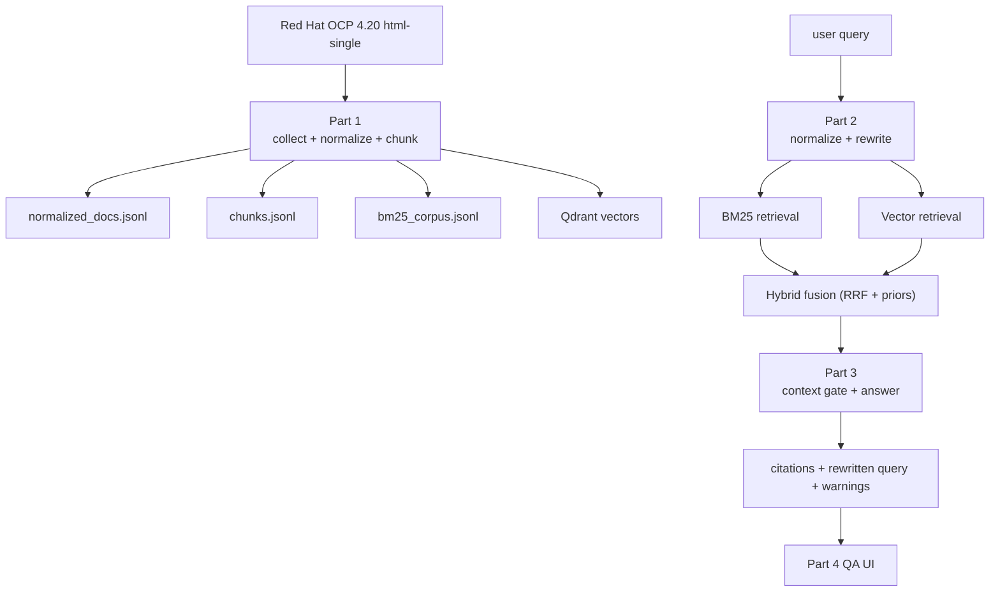

# OCP 운영/교육 가이드 RAG 챗봇

폐쇄망에서 동작하는 한국어 우선 OpenShift Container Platform RAG 챗봇 프로젝트다.  
이 저장소의 목적은 "문서를 많이 긁어오는 챗봇"을 만드는 것이 아니라, OCP 운영 질문과 교육 질문에 대해 **근거 기반으로**, **검증 가능한 방식으로**, **멀티턴 대화까지 포함해** 답하는 시스템을 만드는 것이다.

이 README는 단순 실행 가이드가 아니다.  
현재 코드베이스가 어떤 구조로 설계되어 있고, 왜 이런 알고리즘을 선택했는지, 어디까지 구현되었고 어디가 아직 남아 있는지를 아키텍처 관점에서 설명한다.

## 1. 이 프로젝트가 풀려는 문제

OCP 문서는 양이 많고, 주제가 넓고, 운영 관점과 학습 관점이 섞여 있다. 폐쇄망에서는 외부 검색에 기대기 어렵기 때문에, 내부에 가져온 문서만으로 다음 문제를 해결해야 한다.

1. 운영자가 `etcd 백업은 어떻게 해?` 같은 질문을 했을 때, 실행 가능한 근거를 빠르게 제시해야 한다.
2. 초보 사용자가 `OpenShift 아키텍처를 설명해줘`라고 했을 때, 설치 절차 문서가 아니라 개념 문서를 우선 찾아야 한다.
3. `그 복구는 어떻게 해?`, `그거는 누가 관리해?` 같은 follow-up 질문에서 이전 맥락을 해석해야 한다.
4. 애매하거나 근거가 약하면 길게 추측하지 말고 짧게 clarification 해야 한다.
5. 답변에 붙는 citation은 외부 웹이 아니라 내부 문서 경로로 연결되어야 한다.

즉 이 프로젝트의 본질은 `문서 수집`도 아니고 `LLM 호출`도 아니다.  
본질은 아래 네 가지를 동시에 만족시키는 것이다.

- 올바른 문서를 찾는 검색 품질
- 찾은 문서만으로 답하는 grounding 품질
- 멀티턴 대화에서의 reference resolution
- 폐쇄망 환경에 맞는 내부 문서 UX

## 2. 설계 원칙

[AGENTS.md](/C:/Users/soulu/cywell/ocp-rag-chatbot/AGENTS.md)의 안정 규칙을 코드 설계에 그대로 반영했다.

- 지원되지 않는 주장 금지
- 명령어, 버전, 절차, citation 날조 금지
- retrieval 품질과 answer 품질 분리
- 애매하면 추측보다 clarification
- 복잡한 마법보다 inspectable pipeline 우선
- 큰 변경에는 반드시 테스트 함의가 있어야 함
- benchmark 점수보다 실제 사용자 질문 기준으로 판단

실제로 이 프로젝트는 일부 단계에서 점수가 좋아 보여도 UI 실물 테스트에서 망가지는 경험을 겪었다. 그래서 지금 구조는 "점수 최적화"보다 "실물 검증 가능한 구조"를 우선한다.

## 3. 전체 구조

시스템은 4단계로 나뉜다.

1. Part 1: 문서 수집 / 정규화 / 청킹 / 임베딩 / 인덱싱
2. Part 2: 질의 정규화 / 리라이트 / BM25 + 벡터 검색 / 하이브리드 랭킹
3. Part 3: context assembly / answer generation / citation formatting
4. Part 4: QA용 최소 채팅 UI



핵심 포인트는 다음이다.

- Part 1은 "문서를 어떤 단위로 잘라야 나중에 잘 찾히는가"를 담당한다.
- Part 2는 "질문을 어떤 검색 질의로 바꾸고, BM25와 vector를 어떻게 합칠 것인가"를 담당한다.
- Part 3은 "찾아온 문서 중 무엇을 실제 답변 근거로 넘길 것인가"를 담당한다.
- Part 4는 제품 UI라기보다 현재는 **실물 QA 콘솔**이다.

## 4. 왜 4단계로 분리했는가

많은 RAG 프로젝트는 처음부터 "질문 -> 답변" end-to-end로 붙이고 거기서 문제를 고친다. 이 방식은 빠르게 데모를 만들 수는 있지만, 실패 원인을 분해하기 어렵다.

이 프로젝트는 일부러 다음처럼 분리했다.

- Part 1 실패: 문서/메타데이터/청킹 문제
- Part 2 실패: 검색 문제
- Part 3 실패: context gate / prompt / answer 문제
- Part 4 실패: UI / 링크 / 실사용 흐름 문제

예를 들어 사용자가 `오픈시프트가 뭐야?`라고 물었을 때 설치 문서가 나오면, 그건 answer 문제가 아니라 retrieval 문제다.  
반대로 문서는 잘 찾았는데 해당 책이 영어 본문만 있으면, 그건 retrieval 성공 + answer UX 실패다.

이 분해가 가능해야 수정이 하드코딩으로 흐르지 않는다.

## 5. 저장소 구조

현재 repo는 `part1`, `part2`, `part3`, `part4` 기준으로 모듈이 나뉜다.  
이름이 다소 작업 단계 중심인 이유는 아직 구조를 리팩터링으로 예쁘게 만드는 단계가 아니라, 각 실패가 어느 파트에서 나는지 드러내는 단계이기 때문이다.

주요 파일:

- [src/ocp_rag_part1/pipeline.py](/C:/Users/soulu/cywell/ocp-rag-chatbot/src/ocp_rag_part1/pipeline.py)
- [src/ocp_rag_part1/normalize.py](/C:/Users/soulu/cywell/ocp-rag-chatbot/src/ocp_rag_part1/normalize.py)
- [src/ocp_rag_part1/chunking.py](/C:/Users/soulu/cywell/ocp-rag-chatbot/src/ocp_rag_part1/chunking.py)
- [src/ocp_rag_part2/query.py](/C:/Users/soulu/cywell/ocp-rag-chatbot/src/ocp_rag_part2/query.py)
- [src/ocp_rag_part2/retriever.py](/C:/Users/soulu/cywell/ocp-rag-chatbot/src/ocp_rag_part2/retriever.py)
- [src/ocp_rag_part3/context.py](/C:/Users/soulu/cywell/ocp-rag-chatbot/src/ocp_rag_part3/context.py)
- [src/ocp_rag_part3/answerer.py](/C:/Users/soulu/cywell/ocp-rag-chatbot/src/ocp_rag_part3/answerer.py)
- [src/ocp_rag_part4/server.py](/C:/Users/soulu/cywell/ocp-rag-chatbot/src/ocp_rag_part4/server.py)

실행 스크립트:

- [scripts/build_source_manifest.py](/C:/Users/soulu/cywell/ocp-rag-chatbot/scripts/build_source_manifest.py)
- [scripts/run_part1.py](/C:/Users/soulu/cywell/ocp-rag-chatbot/scripts/run_part1.py)
- [scripts/run_part2_sanity.py](/C:/Users/soulu/cywell/ocp-rag-chatbot/scripts/run_part2_sanity.py)
- [scripts/run_part3_answer.py](/C:/Users/soulu/cywell/ocp-rag-chatbot/scripts/run_part3_answer.py)
- [scripts/run_part3_eval.py](/C:/Users/soulu/cywell/ocp-rag-chatbot/scripts/run_part3_eval.py)
- [scripts/run_part4_ui.py](/C:/Users/soulu/cywell/ocp-rag-chatbot/scripts/run_part4_ui.py)

계획/정책 문서:

- [PROJECT_PLAN.md](/C:/Users/soulu/cywell/ocp-rag-chatbot/PROJECT_PLAN.md)
- [EVALS.md](/C:/Users/soulu/cywell/ocp-rag-chatbot/EVALS.md)
- [CURRENT_PHASE.md](/C:/Users/soulu/cywell/ocp-rag-chatbot/CURRENT_PHASE.md)
- [STATUS_2026-04-02.md](/C:/Users/soulu/cywell/ocp-rag-chatbot/STATUS_2026-04-02.md)

## 6. Part 1: 문서 전처리 파이프라인

### 6.1 입력

입력 원본은 OCP 4.20의 `html-single` 문서다.  
manifest는 [manifests/ocp_ko_4_20_html_single.json](/C:/Users/soulu/cywell/ocp-rag-chatbot/manifests/ocp_ko_4_20_html_single.json)에 저장된다.

### 6.2 정규화 목표

Part 1의 목표는 HTML을 "사람이 다시 검사할 수 있는 중간 산출물"로 바꾸는 것이다.  
즉 PDF처럼 opaque한 blob이 아니라, 아래 필드를 가진 명시적 레코드로 바꾼다.

- `book_slug`
- `book_title`
- `heading`
- `section_level`
- `section_path`
- `anchor`
- `source_url`
- `viewer_path`
- `text`

### 6.3 정규화 알고리즘

[normalize.py](/C:/Users/soulu/cywell/ocp-rag-chatbot/src/ocp_rag_part1/normalize.py)는 다음 순서로 동작한다.

1. `article` 본문만 선택
2. `script`, `style`, `nav`, `footer` 등 제거
3. `<pre>`를 `[CODE] ... [/CODE]` 블록으로 보존
4. `<table>`을 `[TABLE] ... [/TABLE]` 텍스트 블록으로 변환
5. heading을 `<<<HEADING ... >>>` 마커로 치환
6. 마커를 다시 파싱해서 `section_path`, `anchor`, `section_level` 복원
7. `Legal Notice`, 언어 fallback 안내 같은 노이즈 섹션 제거

이 방식의 장점은 단순 문자열 분리가 아니라, **HTML 구조를 한 번 명시적으로 기록한 뒤 다시 section 레코드로 변환**한다는 점이다.  
그래서 heading 기반 chunking이 가능해지고, 나중에 citation anchor도 유지된다.

### 6.4 청킹 전략

이 프로젝트의 청킹은 처음부터 헤더 기반을 전제로 설계되었다.

전략:

1. 문서를 section 단위로 먼저 자른다.
2. 각 section 안에서는 문단 블록으로 나눈다.
3. `chunk_size`를 넘는 블록만 토큰 기준으로 추가 분할한다.
4. `[CODE]`, `[TABLE]` 블록은 가능하면 깨지지 않게 유지한다.

현재 기본값:

- `chunk_size=160`
- `chunk_overlap=32`

관련 구현:
- [chunking.py](/C:/Users/soulu/cywell/ocp-rag-chatbot/src/ocp_rag_part1/chunking.py)
- [settings.py](/C:/Users/soulu/cywell/ocp-rag-chatbot/src/ocp_rag_part1/settings.py)

### 6.5 왜 SentenceTransformer tokenizer를 쓰는가

임베딩은 원격 endpoint에서 생성하지만, chunk sizing은 로컬에서 명시적으로 계산해야 한다.  
그래서 로컬에서는 `SentenceTransformer("dragonkue/bge-m3-ko")`의 tokenizer를 사용해 토큰 길이를 센다.

이렇게 분리한 이유:

- 임베딩 경로는 서버 운영 정책의 문제
- chunk sizing은 전처리 재현성과 inspectability의 문제

즉 `임베딩 서버`와 `청킹 기준 모델`은 역할이 다르다.

### 6.6 길이 초과 문제를 어떻게 막았는가

이전에는 매우 긴 블록이 tokenizer로 한 번에 들어가면서 `9688 > 8192` 같은 경고가 발생했다.  
현재는 [chunking.py](/C:/Users/soulu/cywell/ocp-rag-chatbot/src/ocp_rag_part1/chunking.py)의 `_split_text_for_tokenizer()`가 먼저 긴 텍스트를 문자 단위로 잘라서 tokenizer에 넣는다.

즉 현재 정책은:

- 긴 입력 경고를 프롬프트 문제로 축소하지 않음
- 전처리 파이프라인 입력 계약 문제로 분류
- tokenizer 호출 전에 분할해서 해결

## 7. Part 1 산출물

canonical artifacts 루트는 repo 안이 아니라 외부 경로를 쓴다.

- `C:\Users\soulu\cywell\ocp-rag-chatbot-data`

대표 산출물:

- `part1/raw_html/*.html`
- `part1/normalized_docs.jsonl`
- `part1/chunks.jsonl`
- `part1/bm25_corpus.jsonl`
- `part1/preprocessing_log.json`
- `part1/data_quality_report.json`

현재 full rebuild 결과:

- `manifest_count=113`
- `collected_count=113`
- `normalized_count=23557`
- `chunk_count=95679`
- `embedded_count=95679`
- `qdrant_upserted_count=95679`

## 8. Part 2: 검색 파이프라인

Part 2의 목표는 "LLM이 그럴듯하게 말하게 하기"가 아니라, **질문에 맞는 책과 청크를 먼저 찾는 것**이다.

### 8.1 왜 BM25와 벡터를 같이 쓰는가

OCP 질문은 크게 두 부류가 있다.

- 용어가 정확한 운영 질의
  - 예: `etcd 백업은 어떻게 해?`
- 설명형/개념형/모호한 질의
  - 예: `오픈시프트가 뭐야?`

BM25는 용어 일치에 강하고, 벡터 검색은 의미 유사도에 강하다.  
둘 중 하나만 쓰면 다음 문제가 생긴다.

- BM25만 쓰면 broad intro가 특정 세부 책으로 새기 쉽다.
- vector만 쓰면 책 수준 구분이 흐릿해지고, support 문서나 주변 문서가 섞이기 쉽다.

그래서 현재 구조는:

1. 질의 정규화
2. BM25 검색
3. vector 검색
4. RRF 기반 하이브리드 fusion
5. book-level priors 적용

### 8.2 질의 정규화 / 리라이트

[query.py](/C:/Users/soulu/cywell/ocp-rag-chatbot/src/ocp_rag_part2/query.py)는 단순 동의어 치환기가 아니다.  
현재는 질문 의도를 아래처럼 구분한다.

- generic intro
- doc locator
- etcd concept
- etcd ops
- follow-up
- unsupported external product

예를 들어:

- `etcd 백업은 어떻게 해?`
  - `backup`, `restore`, `disaster recovery` 쪽 토큰을 붙인다.
- `etcd가 왜 중요한지 설명해줘`
  - `backup/restore`를 붙이지 않고 `quorum`, `cluster state`, `key-value store` 쪽 개념 토큰을 붙인다.

이 분리가 중요한 이유는, 예전에는 `etcd`가 들어오면 무조건 `backup/restore`를 붙여서 개념 질문도 백업 문서로 끌고 갔기 때문이다.

### 8.3 하이브리드 fusion 알고리즘

[retriever.py](/C:/Users/soulu/cywell/ocp-rag-chatbot/src/ocp_rag_part2/retriever.py)의 핵심은 `fuse_ranked_hits()`다.

기본 수식은 RRF다.

```text
fused_score += weight / (rrf_k + rank)
```

현재 기본 weight:

- BM25: `1.0`
- vector: `1.1`

그 위에 다음 보정이 들어간다.

- BM25와 vector 양쪽에서 지지된 책 가산
- 한국어 질의에서 한국어 텍스트 가산
- broad intro에서는 `architecture`, `overview` boost
- doc-locator에서는 `_apis` 계열 감점
- unsupported 외부 제품 질의는 검색 short-circuit

즉 이 fusion은 단순 평균이 아니라, **랭크 기반 결합 + 도메인 priors** 구조다.

### 8.4 unsupported 질문 처리

`Harbor 설치 방법 알려줘`, `EKS랑 AKS 요금 비교해줘` 같은 질문은 OCP corpus 밖이다.  
이런 경우 억지로 registry나 images 문서를 가져오면 오답이 된다.

현재는 [query.py](/C:/Users/soulu/cywell/ocp-rag-chatbot/src/ocp_rag_part2/query.py)의 `detect_unsupported_product()`가 이를 감지하고, [retriever.py](/C:/Users/soulu/cywell/ocp-rag-chatbot/src/ocp_rag_part2/retriever.py)에서 경고와 함께 빈 hit로 반환한다.

즉 unsupported는 "못 찾음"이 아니라 **의도적으로 검색을 끊는 정책**이다.

### 8.5 retrieval sanity set

실사용 질문 분포를 반영하기 위해 offline sanity gate를 별도로 뒀다.

파일:

- [manifests/part2_retrieval_sanity_cases.jsonl](/C:/Users/soulu/cywell/ocp-rag-chatbot/manifests/part2_retrieval_sanity_cases.jsonl)
- [scripts/run_part2_sanity.py](/C:/Users/soulu/cywell/ocp-rag-chatbot/scripts/run_part2_sanity.py)
- [src/ocp_rag_part2/sanity.py](/C:/Users/soulu/cywell/ocp-rag-chatbot/src/ocp_rag_part2/sanity.py)

현재 sanity 결과:

- `case_count=25`
- `expected_hit_at_1=1.0`
- `expected_hit_at_3=1.0`
- `expected_hit_at_5=1.0`
- `forbidden_free_at_3=1.0`

단, `warning_free_rate=0.92`인 이유는 unsupported 2건에서 의도적으로 경고를 남기기 때문이다.

## 9. Part 3: 답변 파이프라인

Part 3의 핵심은 "검색 결과 전체를 프롬프트에 다 넣지 않는다"는 것이다.

### 9.1 context assembly

[context.py](/C:/Users/soulu/cywell/ocp-rag-chatbot/src/ocp_rag_part3/context.py)는 retrieval hit 중 일부만 골라 prompt context로 만든다.

주요 정책:

- top score가 약하고 경쟁 책이 강하면 context를 비워 clarification 유도
- top book 위주로만 context를 축소
- book당 너무 많은 청크를 넣지 않음
- cross-book mirror section은 제거
- excerpt는 최대 길이로 자름

이게 필요한 이유는, retrieval top-k를 전부 넣으면 support 문서나 유사 섹션이 답변을 오염시키기 때문이다.

### 9.2 answer generation

[answerer.py](/C:/Users/soulu/cywell/ocp-rag-chatbot/src/ocp_rag_part3/answerer.py)는 다음 흐름으로 동작한다.

1. Part 2 retrieval 실행
2. context assembly
3. prompt 구성
4. LLM 호출
5. `답변:` 형식 정규화
6. citation index 추출
7. answer log 저장

### 9.3 prompt 설계 철학

[prompt.py](/C:/Users/soulu/cywell/ocp-rag-chatbot/src/ocp_rag_part3/prompt.py)의 system/user prompt는 화려함보다 제약을 우선한다.

핵심 제약:

- 근거 없는 내용 금지
- citation은 실제 제공된 번호만
- ambiguous면 clarification
- follow-up이라도 현재 retrieval 근거가 약하면 단정 금지
- no-evidence 상황에서 assertive answer 금지

즉 Part 3은 "대답을 길게 잘하는 모델"보다, **근거가 약할 때 멈출 수 있는 시스템**을 목표로 한다.

## 10. Part 4: QA UI

현재 UI는 출시용 프로덕트가 아니라 **실답변 QA 콘솔**이다.

구현:

- [src/ocp_rag_part4/server.py](/C:/Users/soulu/cywell/ocp-rag-chatbot/src/ocp_rag_part4/server.py)
- [src/ocp_rag_part4/static/index.html](/C:/Users/soulu/cywell/ocp-rag-chatbot/src/ocp_rag_part4/static/index.html)
- [scripts/run_part4_ui.py](/C:/Users/soulu/cywell/ocp-rag-chatbot/scripts/run_part4_ui.py)

지원 기능:

- Enter 전송
- Shift+Enter 줄바꿈
- follow-up
- mode 전환
- regenerate
- session reset
- rewritten query 표시
- citation 표시
- 내부 `/docs/ocp/4.20/ko/...` 경로 대응

중요한 점:

이 UI는 retrieval/answer 문제가 있으면 그대로 드러내는 도구다.  
즉 UI가 예뻐지는 것보다, "실제로 어떤 질문에서 망가지는지 빨리 드러나는 것"이 목적이다.

## 11. 현재 실행 방법

### 11.1 환경 변수

실제 실행 기준은 [`.env`](/C:/Users/soulu/cywell/ocp-rag-chatbot/.env)다.  
핵심 값:

```powershell
ARTIFACTS_DIR=C:\Users\soulu\cywell\ocp-rag-chatbot-data
EMBEDDING_BASE_URL=http://<embedding-endpoint>/v1
EMBEDDING_MODEL=dragonkue/bge-m3-ko
QDRANT_URL=http://localhost:6333
QDRANT_COLLECTION=openshift_docs
LLM_ENDPOINT=http://<llm-endpoint>/v1
LLM_MODEL=Qwen/Qwen3.5-9B
```

### 11.2 manifest 생성

```powershell
python scripts/build_source_manifest.py
```

### 11.3 Part 1 전체 재실행

```powershell
python scripts/run_part1.py --collect-subset all --process-subset all
```

### 11.4 retrieval sanity

```powershell
python scripts/run_part2_sanity.py
```

### 11.5 단일 답변 테스트

```powershell
python scripts/run_part3_answer.py --mode learn --query "OpenShift 아키텍처를 처음 설명해줘"
```

### 11.6 UI 실행

```powershell
python scripts/run_part4_ui.py
```

## 12. 평가 기준

평가 기준은 [EVALS.md](/C:/Users/soulu/cywell/ocp-rag-chatbot/EVALS.md)에 baseline과 release로 분리되어 있다.

이 프로젝트가 강조하는 점:

- retrieval과 answer를 같은 점수로 뭉개지 않는다.
- release threshold로 MVP 탐색을 막지 않는다.
- score가 좋아도 UI 실물 테스트가 나쁘면 성공으로 보지 않는다.

즉 평가는 두 층이다.

1. offline gate
   - retrieval sanity / benchmark / answer eval
2. online gate
   - UI에서 실제 질문을 던졌을 때 체감 품질

## 13. 현재까지 확인된 한계

현재 시스템은 분명 진전이 있지만, 아직 해결되지 않은 한계가 있다.

### 13.1 한국어 corpus path 안에 영어 문서가 섞여 있음

대표적으로 `backup_and_restore`는 retrieval은 되지만, raw HTML 본문이 영어 위주다.  
즉 "찾기는 맞게 찾았는데, 한국어 답변 UX가 여전히 이상한" 상황이 생긴다.

### 13.2 citation 내부 링크 실물 검증이 더 필요함

코드상으로는 `viewer_path`를 우선하지만, 실사용 중 404와 외부 웹처럼 보이는 흐름이 있었다.  
즉 링크 정책은 코드 수준과 사용자 체감 수준을 둘 다 확인해야 한다.

### 13.3 answer 품질은 retrieval보다 뒤처져 있음

retrieval sanity는 많이 안정됐지만, answer는 여전히 다음 문제를 안고 있다.

- 영어 본문이 걸렸을 때 UX 정책 부족
- unsupported/no-answer 답변 정책 미완성
- ambiguous 질문에서 clarification 품질 추가 개선 필요

## 14. 왜 이 README를 이렇게 썼는가

상세 실행 명령 몇 줄만 있는 README는 "돌려본 사람"은 만들 수 있어도, "이 구조를 왜 이렇게 짰는지 이해한 사람"이라는 증거가 되지 않는다.

이 프로젝트 README는 다음 질문에 답해야 한다고 본다.

1. 왜 Part 1~4로 분리했는가
2. 왜 header-based chunking인가
3. 왜 BM25 + vector + RRF인가
4. 왜 query rewrite를 의도 기반으로 나눴는가
5. 왜 context gate가 필요한가
6. 지금 시스템이 어디까지 맞고 어디서 틀리는가

즉 이 README는 사용법 문서이면서 동시에 현재 아키텍처 설명서다.

## 15. 다음 작업

[STATUS_2026-04-02.md](/C:/Users/soulu/cywell/ocp-rag-chatbot/STATUS_2026-04-02.md) 기준으로 다음 우선순위는 아래와 같다.

1. 한국어 미지원 문서 목록 추출
2. 영어/비한국어 페이지가 검색됐을 때 answer 정책 추가
3. citation이 항상 내부 `/docs/...`로 열리는지 실물 검증
4. 그 다음에 다시 UI 실답변 QA

즉 지금부터의 병목은 "문서를 더 많이 넣는 것"이 아니라, **찾은 문서를 어떤 정책으로 사용자에게 보여줄지**다.
