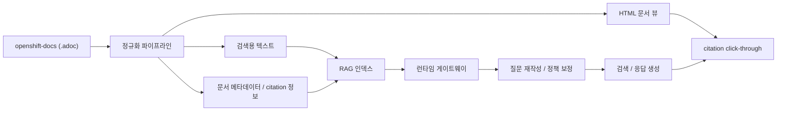

# OCP 운영 도우미 챗봇

폐쇄망 환경에서 사용할 수 있도록 설계 중인 **OCP(OpenShift Container Platform) 운영 지원용 RAG 챗봇 프로젝트**입니다.  
공식 OpenShift 문서를 기반으로 검색하고, 한국어 답변과 citation click-through 를 제공하는 구조를 목표로 개발하고 있습니다.

## 프로젝트 목적

이 프로젝트의 목표는 단순한 문서 검색기가 아니라, 운영자가 실제로 활용할 수 있는 **지식 기반형 OCP 도우미**를 만드는 것입니다.

핵심 목표는 다음과 같습니다.

- 한국어 질문에 답변할 수 있어야 합니다.
- 답변은 공식 문서 근거를 기반으로 해야 합니다.
- 답변에는 출처가 포함되어야 합니다.
- 출처를 클릭하면 원문 HTML 문서가 열려야 합니다.
- 멀티턴 대화를 통해 앞선 질문의 문맥을 이어갈 수 있어야 합니다.
- 폐쇄망 반입, 인덱스 갱신, 활성화, 롤백까지 고려한 구조여야 합니다.

## 적용 기준

이 프로젝트는 내부 지침에 따라 **RAG 구조를 [`OpenDocuments`](https://github.com/joungminsung/OpenDocuments) 기준으로 통일**해 설계했습니다.

다만 이 저장소는 단순 포크가 아니라, 다음 역할을 담당하는 **OCP 적용 프로젝트**입니다.

- `OpenDocuments`: RAG 런타임과 검색 흐름의 기준 플랫폼
- `openshift-docs`: 공식 OCP 문서 원천
- `ocp-rag-chatbot`: OCP 전용 정규화, 정책, 게이트웨이, 운영 흐름을 담당하는 제품 레이어

즉, **RAG 엔진 방향은 OpenDocuments를 따르고**, 이 저장소는 그 위에 OCP용 데이터 파이프라인과 운영 로직을 얹는 구조입니다.

## 모델 구성

현재 기준 모델 구성은 다음과 같습니다.

- 생성 모델: `Qwen/Qwen3.5-9B`
- 임베딩 모델: `BAAI/bge-m3`
- 임베딩 차원: `1024`

설계 의도는 다음과 같습니다.

- 생성 모델은 회사 제공 런타임을 사용합니다.
- 임베딩은 한국어 질문과 영어 공식 문서를 함께 다루기 위해 `BAAI/bge-m3` 를 baseline 으로 사용합니다.
- 민감한 엔드포인트와 토큰 값은 코드에 하드코딩하지 않고 `.env` 로 관리합니다.

## 목표 기능

- 한국어 질문 입력
- OpenShift 공식 문서 기반 검색
- 한국어 답변 생성
- 클릭 가능한 citation 제공
- HTML 기반 원문 문서 뷰어 제공
- 세션 기반 멀티턴 문맥 유지
- 로컬 실행용 게이트웨이 및 런타임 스택 제공

## 시스템 개요

이 프로젝트는 크게 4개 계층으로 구성됩니다.

1. **문서 수집/정규화 계층**
   - `openshift-docs` 원본 `.adoc` 문서를 읽습니다.
   - 검색용 텍스트와 HTML 뷰어 문서를 함께 생성합니다.
   - 문서별 메타데이터와 citation 연결 정보를 생성합니다.

2. **RAG 계층**
   - `OpenDocuments` 기반 런타임을 사용합니다.
   - 정규화된 문서를 인덱싱합니다.
   - 검색 결과를 정책 기반으로 보정합니다.
   - 문서 우선순위, source/category 힌트, follow-up 문맥을 반영합니다.

3. **런타임 계층**
   - 사용자 요청을 받는 게이트웨이
   - OpenDocuments 연동 브리지
   - 실제 질의응답과 출처 정리를 담당하는 응답 경로

4. **운영 계층**
   - 문서 반입
   - 인덱스 생성
   - 활성화
   - 스모크 테스트
   - 롤백

## 파이프라인



## 데이터 처리 방식

### 1. 문서 원천

- 공식 데이터 원천은 `openshift-docs` 저장소입니다.
- 원본 포맷은 AsciiDoc(`.adoc`)입니다.
- PDF나 렌더링 결과물이 아니라 **원본 문서 소스**를 기준으로 처리합니다.

### 2. 정규화

정규화 단계에서는 아래 산출물이 생성됩니다.

- 검색용 텍스트
- HTML 문서 뷰어 파일
- 문서/섹션 메타데이터
- viewer URL
- citation 연결 정보

### 3. 출처 처리

답변의 출처는 단순 파일명이 아니라 **실제 클릭 가능한 문서 링크**로 제공됩니다.

- 답변에 citation 표시
- citation 클릭 시 내부 HTML 문서 열기
- 가능한 경우 섹션 수준까지 연결

## 런타임 구조

현재 로컬 실행 기준 포트는 다음과 같습니다.

- `8000`: 사용자 게이트웨이 / 브라우저 UI
- `18101`: OpenAI 호환 브리지
- `18102`: OpenDocuments 런타임

사용자는 기본적으로 아래 주소만 사용하면 됩니다.

- `http://127.0.0.1:8000`

## 실행 방법

### 1. 환경 변수 준비

민감 정보는 코드에 하드코딩하지 않고 `.env` 로 관리합니다.

예시:

```env
OD_SERVER_BASE_URL=http://127.0.0.1:18102
LLM_ENDPOINT=company
LLM_EP_COMPANY_URL=http://...
LLM_EP_COMPANY_MODEL=Qwen/Qwen3.5-9B
OD_EMBEDDING_MODEL=BAAI/bge-m3
OD_EMBEDDING_DIMENSIONS=1024
```

### 2. 런타임 기동

```powershell
powershell -ExecutionPolicy Bypass -File deployment/start_local_runtime.ps1
```

### 3. 접속

브라우저에서:

- `http://127.0.0.1:8000`

### 4. 종료

```powershell
powershell -ExecutionPolicy Bypass -File deployment/stop_local_runtime.ps1
```

## 저장소 구조

```text
app/          런타임 게이트웨이, 브리지, UI
configs/      source profile, 정책, 설정
data/         정규화 결과, manifest, generated 산출물
deployment/   실행, 스모크 테스트, 반입/활성화/롤백
docs/         설계 및 운영 문서
eval/         benchmark, 회귀 검증, 리포트 생성
indexes/      생성된 인덱스와 관련 산출물
ingest/       openshift-docs 정규화 파이프라인
```

## 주요 구성요소

- `app/ocp_runtime_gateway.py`
  - 사용자 요청 수신
  - citation 정리
  - 멀티턴 흐름 연결

- `app/opendocuments_openai_bridge.py`
  - OpenDocuments 와 모델 서버 사이의 브리지
  - 임베딩/채팅 요청 처리

- `app/ocp_policy.py`
  - 질의 신호 해석
  - source/category/path term 기반 retrieval 보정

- `app/multiturn_memory.py`
  - 세션 메모리 관리
  - 후속 질문 rewrite 지원

- `ingest/normalize_openshift_docs.py`
  - `.adoc` -> 검색용 텍스트 + HTML 문서 + 메타데이터 생성

## 설계 원칙

- RAG 구조는 OpenDocuments 기준으로 통일
- 공식 문서 우선
- 한국어 사용성 우선
- 출처 검증 가능성 우선
- 폐쇄망 운영 가능성 고려
- 특정 minor 버전에 즉시 하드고정하지 않고, 향후 source profile 전환이 가능하도록 설계

## 현재 상태

현재 저장소는 **설계, 파이프라인, 런타임 스택, 문서 정규화, citation viewer 구조까지 구현된 프로토타입 단계**입니다.

현재 확인 가능한 범위:

- `openshift-docs` 기반 정규화 파이프라인
- HTML citation viewer 생성 구조
- OpenDocuments 기반 RAG 런타임 연동 구조
- 로컬 게이트웨이/브리지/런타임 실행 스크립트
- retrieval / multiturn / red-team / runtime 검증 스크립트

다만 아래 항목은 계속 품질 보강 중입니다.

- 실제 `localhost:8000` 런타임의 안정성
- 기본 질문과 운영 질문에 대한 한국어 응답 품질
- expanded corpus 기준 retrieval 안정성
- operator release 수준의 최종 품질 보증

즉, 이 README는 **현재 완성 제품 소개서라기보다, 프로젝트의 설계와 구현 범위를 설명하는 문서**로 보는 것이 맞습니다.

## 주의 사항

- 이 프로젝트는 내부/폐쇄망 운영을 고려한 구조입니다.
- `.env` 및 토큰 정보는 저장소에 커밋하지 않습니다.
- 문서 코퍼스가 커질수록 retrieval 품질 검증이 중요해집니다.

## 참고

- 공식 문서 원천: `openshift-docs`
- 로컬 UI 주소: `http://127.0.0.1:8000`
