# PlayBookStudio
http://127.0.0.1:5173

## Submission Snapshot

- 과제 목적: `사용자 -> RAG -> LLM` 전체 파이프라인을 PBS 안에서 직접 구현하고, OCP 운영 지식 저장소로 시연 가능한 상태까지 검증
- 서비스 표면: `Playbook Library / Wiki Runtime Viewer / Chat Workspace`
- LLM: `Qwen/Qwen3.5-9B`
- Embedding: `BGE-m3`
- Streaming: `POST /api/chat/stream` NDJSON 이벤트 스트림
- Vector store: `Qdrant`
- Sparse retrieval: repo 내부 구현 `BM25Index`
- 멀티턴 메모리: 세션별 `SessionContext` + turn history 직접 관리
- 외부 프레임워크: `LangChain`, `LlamaIndex` 같은 orchestration framework 미사용

## Evaluation Mapping

| 평가 항목 | 현재 구현 | 근거 파일 |
| --- | --- | --- |
| RAG 정확성 | 질문 정규화 -> 질의 재작성 -> BM25/vector 검색 -> hybrid fusion -> graph expand(optional) -> rerank -> context 조립 -> citation finalize | `src/play_book_studio/retrieval/retriever_pipeline.py`, `src/play_book_studio/answering/context.py`, `src/play_book_studio/answering/answerer.py` |
| 멀티턴 5턴 이상 | 세션별 `current_topic`, `open_entities`, `unresolved_question`, `selected_draft_ids`를 저장하고 후속 turn에 재사용 | `src/play_book_studio/retrieval/models.py`, `src/play_book_studio/app/session_flow.py`, `src/play_book_studio/app/sessions.py` |
| Streaming 응답 | `/api/chat/stream` 가 trace event와 최종 result를 NDJSON으로 순차 전송 | `src/play_book_studio/app/server_handler_factory.py`, `src/play_book_studio/app/server_chat.py`, `tests/test_app_chat_api_multiturn.py` |
| Vector index 직접 설계 | chunk JSONL + BM25 JSONL + Qdrant payload를 직접 구성하고, SDK 대신 HTTP 요청으로 vector search 수행 | `src/play_book_studio/ingestion/pipeline.py`, `src/play_book_studio/retrieval/bm25.py`, `src/play_book_studio/retrieval/vector.py` |
| 성능 개선 | hybrid retrieval, semantic rerank, follow-up/설명형 query에만 graph/rerank를 선택 적용 | `src/play_book_studio/retrieval/retriever_pipeline.py`, `src/play_book_studio/retrieval/retriever_rerank.py` |
| 캐싱 전략 | LRU/TTL 기반 runtime cache, citation serialization cache, translation draft cache 적용 | `src/play_book_studio/runtime_catalog_registry.py`, `src/play_book_studio/app/presenters.py`, `src/play_book_studio/app/server_support.py`, `src/play_book_studio/canonical/translate.py` |
| 시연 하네스 | 5개 시나리오 x 6턴 = 총 30턴 멀티턴 대화 자동 검증 | `scripts/run_ocp420_demo_simulator.py`, `manifests/ocp420_demo_simulator_scenarios.jsonl`, `reports/demo_simulator/ocp420_demo_simulator_eval.json` |

## Actual Pipeline Architecture

```mermaid
flowchart TD
  subgraph OCP["Official OCP lane"]
    O1["Official repo AsciiDoc"] --> O2["Custom AsciiDoc AST parser"]
    O2 --> O3["Structured runtime"]
    O3 --> O4["Viewer / Corpus / Chat"]
    OF["Published HTML/PDF"] -. "verification / explicit fallback only" .-> O2
  end

  subgraph CU["Customer upload lane"]
    U1["User upload"] --> U2{"Source type"}

    U2 -->|"pdf / docx / pptx / xlsx"| M1["1. MarkItDown primary"]
    M1 -->|"ok"| N1["Canonical normalize"]
    M1 -. "fail / low confidence" .-> D1["2. Docling parse"]

    D1 -->|"ok"| N1
    D1 -. "fail" .-> D2["3. Docling OCR"]

    D2 -->|"ok"| N1
    D2 -. "fail / degraded" .-> P1["4. pypdf text + outline"]

    P1 -->|"ok"| N1
    P1 -. "needs rendered OCR" .-> R1["5. pypdfium2 render + RapidOCR"]

    R1 -->|"ok"| N1
    R1 -. "still degraded + remote OCR allowed" .-> S1["6. Surya remote OCR fallback"]

    S1 -->|"ok"| N1
    S1 -. "not configured / unavailable" .-> X1["7. Marker stub only"]

    U2 -->|"web / md / asciidoc / txt"| T1["Direct normalize"]
    T1 --> N1

    U2 -->|"image"| I1["Docling image parse"]
    I1 -->|"ok"| N1
    I1 -. "fail / low confidence" .-> S1

    N1 --> U3["Customer pack runtime / User Library"]
  end

  subgraph RT["Retrieval / Chat runtime"]
    RTA["Remote TEI embedding: bge-m3-ko"] --> RTB["Qdrant vector store"]
    RTC["CrossEncoder reranker"] --> RTD["Neo4j graph option"]
    RTB --> RTE["Grounded retrieval"]
    RTC --> RTE
    RTD --> RTE
    RTE --> RTF["LLM /chat/completions"]
  end
```



### Priority Notes

- `공식 OCP`의 주력 파서는 [src/play_book_studio/canonical/asciidoc.py](/C:/Users/soulu/cywell/ocp-play-studio/ocp-play-studio/src/play_book_studio/canonical/asciidoc.py) 이다.
- `Docling / MarkItDown / Surya`는 `공식 OCP 주력 라인`이 아니라 `customer upload / fallback` 쪽 도구다.
- OCR fallback priority는 `RapidOCR first`, `Surya second` 다.
- `pypdf` 와 `pypdfium2` 는 실제 가동 중이다.
- `Marker` 는 현재 `미설치 + 미구현 adapter slot` 이라 사실상 미사용 stub 이다.
- `5173` 은 현재 `Vite dev server` 가 아니라 `Vite preview serve` 다.


PBS runtime repository입니다.

이 문서는 `reference README` 이면서, 현재 과제 제출 시연 기준도 함께 담는다.  
현재 실행 계약은 아래 active root 문서를 우선한다.

- `AGENTS.md`
- `PROJECT.md`
- `RUNTIME_ARCHITECTURE_CONTRACT.md`
- `EXECUTION_HARNESS_CONTRACT.md`
- `SECURITY_BOUNDARY_CONTRACT.md`

제품 표면은 아래 3가지로 본다.

- `Playbook Library`
- `Wiki Runtime Viewer`
- `Chat Workspace`

공식 문서 lane 의 기준은 아래다.

- `repo/AsciiDoc first`
- `published HTML` 은 `reader benchmark / verification / fallback`
- `published PDF` 는 `reader verification / fallback`

`Playbook` 은 최신 고정 파이프라인을 통과한 문서 중,
`원문 충실도 + 챗봇 상호작용성` 을 동시에 만족하는 위키 단위다.

공식 lane 에서 영어 본문이 발견되면 기본 처리 순서는 `번역 -> 검증 -> publish` 다.

## Direct-Built RAG Notes

- 질문 해석과 검색 orchestration은 repo 내부 로직으로 직접 구현했다. `query normalize`, `rewrite`, `candidate budget`, `follow-up detection`, `rerank gating`, `graph expand gating` 가 모두 코드에 명시돼 있다.
- sparse 검색은 `BM25Index.from_jsonl()` 로 JSONL corpus를 읽어 직접 토큰화/IDF/BM25 scoring을 계산한다.
- dense 검색은 `EmbeddingClient` 로 질의를 임베딩한 뒤 Qdrant REST endpoint에 직접 POST 해서 후보를 가져온다.
- hybrid fusion은 BM25와 vector 후보를 결합하고, 상황에 따라 customer/private overlay 후보를 rescue 한다.
- 답변 단계에서는 retrieval hit 전체를 그대로 넣지 않고, 질문 종류와 안전성에 맞춰 `citation` 과 `context chunk` 를 다시 고른 뒤 prompt를 조립한다.
- citation은 answer 후처리에서 다시 정리하며, viewer path/source url/runtime truth를 함께 묶어 surface와 챗봇이 같은 근거를 보게 만든다.

## Multiturn, Streaming, Cache

- 세션 메모리는 LLM provider의 hidden history에 맡기지 않고 PBS가 직접 보존한다. 세션 snapshot에는 최근 최대 20개 turn, 현재 topic, 열려 있는 엔티티, 미해결 질문이 저장된다.
- follow-up 질문이면 이전 `user_goal/current_topic/unresolved_question` 을 재사용해 검색 대상을 좁힌다.
- 스트리밍은 token 단위 생성이 아니라 `request_received -> retrieval/fusion/graph/rerank trace -> final result` 흐름을 NDJSON chunk로 밀어준다.
- 캐시는 한 가지가 아니라 여러 층에 있다. runtime catalog/viewer/citation serialization은 process-local cache를 사용하고, 번역 draft는 파일 cache를 사용한다.

## Demo And Evaluation Evidence

- 멀티턴 API 회귀 테스트: `tests/test_app_chat_api_multiturn.py`
- 데모 시뮬레이터 시나리오: `manifests/ocp420_demo_simulator_scenarios.jsonl`
- 데모 시뮬레이터 결과: `reports/demo_simulator/ocp420_demo_simulator_eval.json`
- 현재 저장된 결과 기준:
  - `scenario_count = 5`
  - `turn_count = 30`
  - `scenario_completion_rate = 1.0`
  - `turn_pass_rate = 1.0`
  - `streaming_turn_pass_rate = 1.0`
  - `hallucination_guard_pass_rate = 1.0`
  - `history_pass_rate = 1.0`

## Submission Runbook

### 1. 제품 실행

```powershell
docker compose up -d --build backend frontend qdrant
```

### 2. 멀티턴/스트리밍 API 확인

```powershell
.\.venv\Scripts\python -m pytest tests/test_app_chat_api_multiturn.py -q
```

### 3. 데모 시나리오 하네스 실행

```powershell
powershell -ExecutionPolicy Bypass -File scripts\codex_python.ps1 `
  -ScriptPath scripts\run_ocp420_demo_simulator.py `
  -WriteScope reports/demo_simulator/ocp420_demo_simulator_eval.json `
  -VerifyCmd "OCP 4.20 demo simulator"
```

### 4. 제출 시 설명 포인트

- `왜 RAG인가`: 공식 OCP 문서와 업로드 문서를 같은 viewer/corpus truth 위에서 검색하기 위해서
- `왜 직접 구현인가`: retrieval, session memory, streaming, citation shaping을 모두 repo 내부 코드로 통제하기 위해서
- `정확도 개선`: hybrid retrieval + rerank + follow-up context + chunk selection
- `안전장치`: 근거 밖 내용 억제, citation 강제, official/private boundary truth 유지

## Requirements

- `Docker Desktop` 또는 `Docker Engine + Compose plugin`
- `Python 3.11+`
- `Node.js` 최근 LTS

## Setup

```powershell
python -m venv .venv
.\.venv\Scripts\python -m pip install -U pip
.\.venv\Scripts\python -m pip install -e .

cd presentation-ui
npm install
cd ..
```


### 1-1. Docker Compose serve stack

`docker-compose.yml` 기준 기본 프런트는 `Vite dev server` 가 아니라 `build 결과물을 preview serve` 하는 모드다.

```powershell
docker compose up -d --build backend frontend qdrant
```

- UI serve: `http://127.0.0.1:5173`
- backend/API: `http://127.0.0.1:8765`
- `5173` 은 `npm run preview` 기반 서빙 주소다.
- `/api`, `/docs`, `/playbooks`, `/wiki` 는 `8765` backend 로 프록시된다.
- 프런트 코드를 바꾼 뒤 이 모드에 반영하려면 `docker compose up -d --build frontend` 후 필요 시 `docker compose up -d --no-deps --force-recreate frontend` 를 실행한다.

### 2. 빠른 UI 개발

UI를 빠르게 수정하면서 보려면 `5173` 개발 서버를 쓰고, 실제 데이터/API는 계속 `8765` 백엔드를 사용합니다.

```powershell
powershell -ExecutionPolicy Bypass -File scripts\pbs-dev-up.ps1
```

- 개발모드: `http://127.0.0.1:5173`
- 제품확인: `http://127.0.0.1:8765`
- 같은 LAN의 다른 PC에서 확인: `http://<내-PC-LAN-IP>:8765`
- `scripts\pbs-dev-up.ps1` 는 `qdrant + shared backend(8765) + vite(5173)` 를 함께 띄웁니다.
- Vite가 `/api`, `/docs`, `/playbooks`, `/wiki` 를 백엔드 `8765` 로 프록시합니다.

## Common Commands

### 단일 질의 실행

```powershell
.\play_book.cmd ask --query "etcd 백업 절차 알려줘"
```

### Runtime report 생성

```powershell
.\play_book.cmd runtime
```

### OCP 4.20 one-click runtime rebuild

```powershell
powershell -ExecutionPolicy Bypass -File scripts\codex_python.ps1 `
  -ScriptPath scripts\run_ocp420_one_click_runtime.py `
  -WriteScope reports/build_logs/ocp420_one_click_runtime_report.json `
  -VerifyCmd "ocp420 one-click runtime"
```

산출물:

- `reports/build_logs/ocp420_one_click_runtime_report.json`

## Test

백엔드:

```powershell
.\.venv\Scripts\python -m pytest tests/test_app_runtime_ui.py tests/test_app_data_control_room.py
```

프런트:

```powershell
cd presentation-ui
npm test
```
