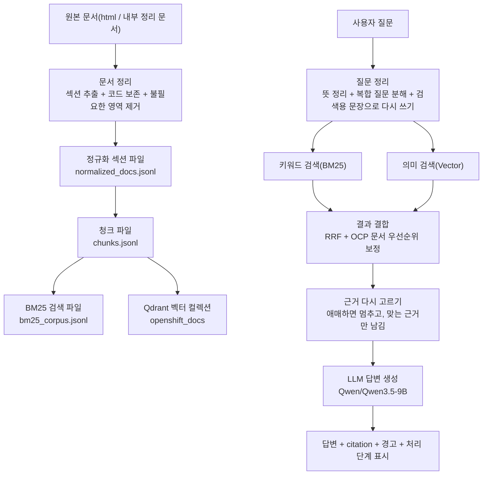

# OCP 운영/교육 가이드 RAG 챗봇

폐쇄망 환경에서 동작하는 한국어 우선 OCP(OpenShift Container Platform) 운영/교육용 RAG 챗봇 프로젝트다.  
이 저장소의 목적은 단순한 “문서 검색 데모”가 아니라, `사용자 -> RAG -> LLM -> citation -> follow-up`까지 이어지는 전체 파이프라인을 직접 구현하고 설명 가능한 상태로 만드는 것이다.

이 README는 실행 방법만 적는 문서가 아니다.  
평가자 또는 연구소 내부 리뷰어가 아래 질문에 답을 얻을 수 있도록 작성했다.

- 이 시스템은 어떤 문제를 풀기 위해 만들어졌는가
- 어떤 단계가 직접 구현되었는가
- 왜 이런 구조를 택했는가
- 멀티턴과 citation은 어떻게 처리되는가
- 현재 어느 정도까지 완성되었고, 어디가 아직 리스크인가

## 세 문장 요약

1. 이 프로젝트는 OCP 운영 질문과 교육 질문에 대해, 외부 검색 없이 내부 문서만으로 근거 기반 답변을 생성하는 폐쇄망 RAG 챗봇이다.
2. 문서 정리, 하이브리드 검색, 멀티턴 세션 상태, 답변 문장 정리, 내부 문서 열람 화면, QA UI를 오픈소스 RAG 프레임워크 없이 직접 분리 구현했다.
3. 현재 강점은 `각 단계가 눈으로 검증 가능한 구조`와 `도메인 특화 평가`, 약점은 `일부 고가치 문서의 한국어 source gap`과 `learn 답변 품질의 잔여 편차`다.

---

## 1. 과제 목적과 현재 프로젝트의 위치

과제 목적은 단순히 챗봇을 만드는 것이 아니라, 아래 역량을 확보하는 데 있다.

- `RAG -> LLM`으로 이어지는 전체 구조 이해
- 폐쇄망 OCP 환경에 맞는 AI 기반 지식 저장소 구축 역량 확보
- 멀티턴 대화와 citation을 포함한 실사용형 질의응답 파이프라인 구현

이 저장소는 그 목적에 맞춰 다음 범위를 직접 구현한다.

- 문서 수집/정규화/청킹/임베딩 적재
- 질의 정규화, follow-up rewrite, 하이브리드 검색
- 컨텍스트 선택, 답변 생성, citation 정리
- 세션 상태 기반 멀티턴 처리
- 스트리밍 채팅 화면과 내부 문서 열람 화면
- 오프라인 eval, 실전 질문 eval, RAGAS eval

중요한 점은, 이 프로젝트가 `LangChain/LlamaIndex 기반 RAG 앱`이 아니라는 것이다.  
문서 구조화, 하이브리드 검색, 최소 대화 상태 설계, clarification/no-answer 정책, citation 후처리 모두 코드베이스 안에서 직접 구현했다.

---

## 2. 요구사항과 직접 구현 범위

이 과제에서 중요한 건 “무슨 라이브러리를 썼는지”보다, **실제로 무엇을 직접 만들었는지**를 제3자가 바로 이해하는 것이다.

그래서 요구사항을 아래처럼 사람 말로 다시 정리한다.

| 과제 요구사항 | 이 프로젝트에서 실제로 한 일 | 현재 상태 |
|---|---|---|
| 질문을 넣으면 RAG를 거쳐 LLM이 답하게 만들 것 | 문서를 미리 정리해 두고, 질문이 들어오면 관련 문서를 찾은 뒤 그 근거만 가지고 답하게 만들었다 | 구현 |
| 오픈소스 RAG 프레임워크를 쓰지 말 것 | 검색 흐름, 멀티턴 처리, citation 정리, UI 응답 흐름을 직접 코드로 만들었다 | 준수 |
| 멀티턴 대화를 지원할 것 | `그거`, `아까 말한 복구`, `거기서 안 지워지면` 같은 이어지는 질문을 이전 문맥과 연결하도록 만들었다 | 구현 |
| 지정된 LLM을 붙일 것 | 사내 Qwen 3.5 서버에 연결해서 실제 답변이 그 모델에서 나오게 했다 | 구현 |
| 지정된 임베딩 모델을 쓸 것 | BGE-M3 임베딩 서버를 사용해 문서를 벡터화하고 검색에 사용한다 | 구현 |
| 스트리밍 응답을 지원할 것 | 답변이 완성될 때까지 기다리는 대신, 진행 상태와 함께 스트리밍으로 보여준다 | 구현 |
| 벡터 인덱스 구조를 직접 설계할 것 | 문서를 어떤 단위로 자를지, 어떤 메타데이터를 붙일지, BM25와 벡터 결과를 어떻게 합칠지 직접 설계했다 | 구현 |
| 세션 단위 문맥 기억을 설계할 것 | 무한 대화기록 대신 현재 주제, 열린 엔터티, 미해결 질문 같은 최소 상태만 유지한다 | 구현 |
| 성능 개선 전략을 넣을 것 | 문서를 헤더 기준으로 나누고, 질문을 검색용으로 다시 쓰고, BM25와 벡터를 함께 쓰는 방식으로 성능을 올렸다 | 구현 |
| 캐싱 전략을 넣을 것 | 일부 캐시는 넣었지만, 동일 질문 답변 재사용 같은 캐시는 아직 덜 끝났다 | 부분 구현 |

여기서 발표 때 솔직하게 말해야 하는 부분은 마지막 항목이다.

- 이미 들어간 캐시
  - 모델 로드 캐시
  - 내부 문서 열람 화면 캐시
- 아직 약한 부분
  - 동일 질문 답변 캐시
  - embedding 결과 영속 캐시

즉 “전부 완벽히 끝났다”가 아니라, **핵심 파이프라인은 직접 구현했고, 캐싱은 부분 구현 상태**라고 설명하는 편이 정직하다.

---

## 3. 이 시스템이 풀려는 실제 문제

OCP 문서는 양이 많고, 주제가 넓고, 운영 관점과 학습 관점이 섞여 있다. 폐쇄망 환경에서는 외부 웹 검색을 쓸 수 없기 때문에, 다음 문제를 내부 문서만으로 풀어야 한다.

1. 운영자가 `etcd 백업은 어떻게 해?`라고 물으면 실행 가능한 절차를 찾아야 한다.
2. 초보 사용자가 `OCP가 뭐야?`라고 물으면 설치나 지원 문서가 아니라 개념 문서로 가야 한다.
3. `그 복구는?`, `거기서 안 지워지면?`, `그거는 누가 관리해?` 같은 follow-up에서 이전 턴을 해석해야 한다.
4. 코퍼스 밖 질문이나 버전 mismatch가 들어오면, 아는 척하지 않고 멈춰야 한다.
5. 답변은 citation이 붙어야 하고, citation은 외부 웹이 아니라 내부 문서 열람 화면으로 열려야 한다.

즉 이 프로젝트의 핵심은 `LLM 호출` 자체가 아니라 아래 네 가지를 동시에 만족시키는 것이다.

- 올바른 문서를 찾는 검색 품질
- 근거가 충분할 때만 답하는 grounding 품질
- 최소 상태만으로 follow-up을 해석하는 멀티턴 품질
- 폐쇄망 시연에 맞는 citation UX

---

## 4. 질문 하나가 답으로 바뀌는 실제 순서

처음 보는 사람이 이해해야 할 핵심은 코드 폴더 구조보다, **질문이 어떤 단계를 거쳐 답으로 바뀌는가**이다.

이 시스템은 아래 순서로 움직인다.

1. 문서를 사람과 기계가 같이 읽을 수 있는 형태로 정리한다.
2. 정리된 문서를 검색용 조각으로 나누고, 각 조각을 벡터로 만든다.
3. 질문이 들어오면 검색하기 좋은 문장으로 다시 다듬는다.
4. 키워드 검색과 의미 검색을 동시에 돌린다.
5. 두 검색 결과를 합쳐서 가장 관련 있는 문서를 위로 올린다.
6. 상위 결과를 전부 쓰지 않고, 실제 답변 근거로 쓸 문서 몇 개만 다시 고른다.
7. 그 근거만 LLM에 넘기고 답변을 만든 뒤, citation과 처리 과정을 화면에 같이 보여준다.



이 분리가 중요한 이유는, 문제가 생겼을 때 원인을 단계별로 분해할 수 있기 때문이다.

- 문서 정리 단계에서 깨지면: 원문 HTML, 섹션 추출, 청킹 문제다.
- 검색 단계에서 깨지면: 질문 정리, BM25, 벡터 검색, 점수 결합 문제다.
- 답변 단계에서 깨지면: 근거 선택 또는 답변 문장 정리 문제다.
- 화면 단계에서 깨지면: 스트리밍, citation 표시, 가독성 문제다.

이 구조 덕분에 `질문 1개마다 예외처리`가 아니라 `실패 유형별 수정`이 가능해진다.

---

## 5. 단계별로 실제로 무엇을 쓰는가

아래 표는 “이 단계에서 정확히 뭘 쓰는지”를 코드 이름이 아니라 동작 기준으로 풀어쓴 것이다.

| 단계 | 실제로 쓰는 것 | 기본값 / 수치 | 출력 |
|---|---|---|---|
| 문서 정리 | OCP 4.20 HTML, 내부 정리 문서, 섹션 추출 로직 | 보일러플레이트 제거, 코드/표 블록 보존 | `normalized_docs.jsonl` |
| 청킹 | 섹션 텍스트, 로컬 tokenizer | `chunk_size=160`, `chunk_overlap=32` | `chunks.jsonl` |
| 키워드 검색 | `bm25_corpus.jsonl`, BM25 | `k1=1.5`, `b=0.75` | BM25 후보 목록 |
| 의미 검색 | BGE-M3 임베딩, Qdrant | `1024차원`, `Cosine`, 후보 `top_k=20` 또는 `40` | Vector 후보 목록 |
| 결과 결합 | Reciprocal Rank Fusion + 문서 우선순위 보정 | `rrf_k=60`, `BM25=1.0`, `Vector=1.1` | 하이브리드 최종 후보 |
| 근거 다시 고르기 | 질문 유형별 cutoff와 책 수 제한 | 개념 질문 최대 4개, 절차 질문 최대 5개 | citation 후보 |
| 답변 생성 | Qwen/Qwen3.5-9B, 모드별 프롬프트 | `temperature=0.2`, `max_tokens=700` | 답변 본문 + inline citation |
| 화면 표시 | NDJSON 스트리밍, 내부 문서 열람 화면 | 단계별 이벤트 표시 | 채팅 UI + 진단 패널 |

이 표에서 제일 중요한 건, 이 프로젝트가 “Qdrant 하나 호출해서 끝”이 아니라는 점이다.  
질문을 다듬는 단계, 검색 결과를 합치는 단계, 근거를 한 번 더 고르는 단계가 각각 따로 있다.

---

## 6. 문서 준비 단계

### 6.1 입력

현재 기본 입력은 OCP 4.20 `html-single` 문서다.  
manifest는 아래 파일에서 시작한다.

- [manifests/ocp_ko_4_20_html_single.json](manifests/ocp_ko_4_20_html_single.json)

운영 현실을 반영하기 위해, 현재는 단순 vendor HTML뿐 아니라 내부 정리 문서/평가 케이스도 함께 다룰 수 있는 구조를 유지하고 있다.

### 6.2 정규화 목표

HTML을 opaque blob으로 두지 않고, 사람이 검토 가능한 section record로 바꾸는 것이 목표다.  
이 단계의 산출물은 다음 정보를 유지한다.

- `book_slug`
- `book_title`
- `heading`
- `section_level`
- `section_path`
- `anchor`
- `source_url`
- `viewer_path`
- `text`

### 6.3 정규화 순서

[src/ocp_rag/ingest/normalize.py](src/ocp_rag/ingest/normalize.py)는 아래 순서로 동작한다.

1. `article` 본문 선택
2. `script/style/nav/footer` 제거
3. `<pre>`를 `[CODE] ... [/CODE]` 블록으로 보존
4. `<table>`을 `[TABLE] ... [/TABLE]`로 보존
5. heading을 마커로 치환해 section 경계 복원
6. `section_path`, `anchor`, `section_level`을 복구
7. `Legal Notice` 같은 보일러플레이트 제거

### 6.4 청킹 전략

청킹은 처음부터 `헤더 기반 + 코드 블록 보존`을 전제로 설계했다.

전략은 다음과 같다.

1. 문서를 section 단위로 자른다.
2. section 안에서 문단 블록으로 나눈다.
3. 긴 블록만 추가 분할한다.
4. `[CODE]`, `[TABLE]`는 가능하면 깨지지 않게 유지한다.

현재 기본값:

- `chunk_size = 160`
- `chunk_overlap = 32`

관련 파일:

- [src/ocp_rag/ingest/chunking.py](src/ocp_rag/ingest/chunking.py)
- [src/ocp_rag/shared/settings.py](src/ocp_rag/shared/settings.py)

추가로 실제 구현은 아래처럼 동작한다.

- 일반 문단은 섹션 안에서 이어 붙여서 `160 토큰` 안으로 맞춘다.
- 너무 긴 문단은 tokenizer 기준으로 강제 분할한다.
- `[CODE] ... [/CODE]`, `[TABLE] ... [/TABLE]`는 가능하면 한 덩어리로 보존한다.
- 다음 청크에는 이전 청크의 끝부분을 `32 토큰` 정도 다시 붙여서 문맥이 갑자기 끊기지 않게 한다.

즉 이 청킹은 단순히 “글자 수로 자르기”가 아니라, **헤더 구조와 코드 예시를 최대한 보존하면서 검색에 유리한 단위로 자르는 방식**이다.

### 6.5 임베딩과 전처리의 역할 분리

임베딩은 원격 endpoint를 사용하지만, chunk 길이 계산은 로컬 tokenizer로 수행한다.

- 임베딩 생성: [src/ocp_rag/ingest/embedding.py](src/ocp_rag/ingest/embedding.py)
- tokenizer/model load cache: [src/ocp_rag/ingest/sentence_model.py](src/ocp_rag/ingest/sentence_model.py)

이렇게 분리한 이유는:

- 임베딩 endpoint는 런타임 인프라 문제
- chunk sizing은 전처리 재현성과 inspectability 문제

### 6.6 문서는 실제로 어디에 어떻게 저장되는가

이 시스템은 문서를 한 번만 저장하지 않는다. 이해하기 쉽게 말하면 **세 번 저장한 뒤 마지막에 벡터DB에 올린다.**

1. 먼저 섹션 단위로 저장한다.
2. 그다음 검색용 청크 단위로 저장한다.
3. 마지막으로 그 청크를 벡터화해서 Qdrant에 넣는다.

#### 1) 섹션 단위 저장: `normalized_docs.jsonl`

한 줄이 대략 이런 구조다.

```json
{
  "book_slug": "architecture",
  "book_title": "아키텍처",
  "heading": "1장. 아키텍처 개요",
  "section_level": 2,
  "section_path": ["아키텍처", "1장. 아키텍처 개요"],
  "anchor": "architecture-overview",
  "source_url": "https://docs.redhat.com/...",
  "viewer_path": "/docs/ocp/4.20/ko/architecture/index.html",
  "text": "OpenShift Container Platform은 ..."
}
```

이 파일은 “원문이 어떤 섹션으로 정리되었는지”를 사람이 직접 검토할 때 쓴다.

#### 2) 청크 단위 저장: `chunks.jsonl`

한 줄이 대략 이런 구조다.

```json
{
  "chunk_id": "7c8f...",
  "book_slug": "architecture",
  "book_title": "아키텍처",
  "chapter": "1장. 아키텍처 개요",
  "section": "1.1. OpenShift Container Platform 소개",
  "anchor": "architecture-overview_1",
  "source_url": "https://docs.redhat.com/...",
  "viewer_path": "/docs/ocp/4.20/ko/architecture/index.html",
  "text": "OpenShift Container Platform은 ...",
  "token_count": 148,
  "ordinal": 3
}
```

이 파일은 “검색과 임베딩의 기준 단위”다.

#### 3) 키워드 검색용 축약본: `bm25_corpus.jsonl`

이 파일은 `chunks.jsonl`의 간소화 버전이다.  
BM25 검색에 꼭 필요한 필드만 남긴다.

- `chunk_id`
- `book_slug`
- `chapter`
- `section`
- `anchor`
- `source_url`
- `viewer_path`
- `text`

#### 4) 벡터 저장: Qdrant `openshift_docs`

Qdrant에는 청크마다 아래 구조로 저장된다.

```json
{
  "id": "7c8f...",
  "vector": [0.0123, -0.1044, "... 1024차원 ..."],
  "payload": {
    "chunk_id": "7c8f...",
    "book_slug": "architecture",
    "book_title": "아키텍처",
    "chapter": "1장. 아키텍처 개요",
    "section": "1.1. OpenShift Container Platform 소개",
    "anchor": "architecture-overview_1",
    "source_url": "https://docs.redhat.com/...",
    "viewer_path": "/docs/ocp/4.20/ko/architecture/index.html",
    "text": "OpenShift Container Platform은 ..."
  }
}
```

현재 기본 Qdrant 설정은 아래와 같다.

- 컬렉션 이름: `openshift_docs`
- 벡터 차원: `1024`
- 거리 계산: `Cosine`
- 업서트 배치: `128`

중요한 점:

- `token_count`, `ordinal`은 청크 파일에는 남지만, Qdrant payload에는 넣지 않는다.
- 즉 “토큰 개수”는 전처리 검증용이고, “Qdrant payload”는 검색 후 citation을 복구하는 데 필요한 정보만 담는다.

이 구조 덕분에 문제가 생기면 아래처럼 단계별로 따로 볼 수 있다.

- `normalized_docs.jsonl`이 이상하면: 정규화 문제
- `chunks.jsonl`이 이상하면: 청킹 문제
- `bm25_corpus.jsonl`이 이상하면: 키워드 검색 문제
- `Qdrant payload/vector`가 이상하면: 벡터 적재 문제

### 6.7 출처로 사용 가능한 문서 선별 단계

문서를 많이 넣는 것보다, `citation으로 써도 되는 문서만 남기는 것`이 중요하다.  
그래서 한국어 적합성 승인 파이프라인을 따로 두었다.

주요 산출물:

- `source_approval_report.json` (`ARTIFACTS_DIR` 아래 ingest approval report)
- `manifests/ocp_ko_4_20_approved_ko.json`

현재 승인 상태:

- 전체 책: `113`
- `approved_ko`: `75`
- `mixed`: `15`
- `en_only`: `23`
- 중요 문서 품질 이슈: `6`

대표 고가치 이슈:

- `backup_and_restore`
- `machine_configuration`
- `monitoring`
- `installing_on_any_platform`

즉 현재 시스템은 단순히 “검색되면 쓴다”가 아니라, `문서 적합성` 자체를 별도 관리한다.

---

## 7. 질문 해석과 검색 단계

이 단계의 목적은 LLM이 그럴듯하게 말하게 하는 것이 아니라, **질문에 맞는 책과 청크를 먼저 찾는 것**이다.

### 7.1 질문을 검색용 문장으로 다시 다듬는 단계

[src/ocp_rag/retrieval/query.py](src/ocp_rag/retrieval/query.py)는 단순 동의어 치환기가 아니다.  
현재는 질문을 다음 질문 유형으로 구분한다.

- intro / broad intro
- compare
- doc locator
- RBAC / 권한 부여
- etcd concept
- etcd backup/restore
- project terminating/finalizers
- certificate monitor
- node drain
- cluster node usage
- logging ambiguity
- update-doc ambiguity
- unsupported external product

예:

- `OCP가 뭐야?`
  - `OpenShift`, `overview`, `소개` 쪽으로 확장
- `etcd 백업은 어떻게 해?`
  - `backup`, `restore`, `disaster recovery` 확장
- `etcd가 왜 중요해?`
  - `quorum`, `cluster state` 쪽으로 확장하고 backup 토큰은 붙이지 않음

### 7.2 복합 질문 분해와 검색용 재작성

멀티턴과 복합 질문 대응을 위해 두 단계가 들어간다.

1. `decompose_retrieval_queries()`
   - 비교 질문, 복합 질문을 여러 subquery로 분해
2. `rewrite_query()`
   - session context를 반영해 standalone search query로 변환

예:

- `오픈시프트와 쿠버네티스 차이를 설명해줘`
  - 원질의
  - `오픈시프트 개요`
  - `쿠버네티스 개요`

- `그 복구는 어떻게 해?`
  - 이전 `current_topic`, `unresolved_question`, `ocp_version`을 반영해 rewrite

### 7.3 BM25 + Vector + 하이브리드 결합

[src/ocp_rag/retrieval/retriever.py](src/ocp_rag/retrieval/retriever.py)의 핵심은 하이브리드 검색이다.

1. BM25 검색
2. Vector 검색
3. Reciprocal Rank Fusion
4. OCP 문서 우선순위 보정

#### BM25 점수는 어떻게 계산되는가

BM25는 문서 안에 질의어가 얼마나 자주 나오는지, 그리고 그 문서가 평균보다 얼마나 긴지를 함께 본다.

현재 토큰화 규칙은 아래 정규식이다.

```text
[\uac00-\ud7a3]+ | [A-Za-z0-9_.-]+
```

즉 한국어는 연속된 한글 덩어리로, 영문/숫자는 `A-Za-z0-9_.-` 묶음으로 나눈다.

현재 기본 BM25 파라미터:

- `k1 = 1.5`
- `b = 0.75`

IDF 계산식:

```text
idf(term) = log(1 + (N - df + 0.5) / (df + 0.5))
```

문서별 BM25 합산식:

```text
score(doc, query)
= Σ idf(term) *
  (
    tf * (k1 + 1)
    /
    (tf + k1 * (1 - b + b * doc_length / avg_doc_length))
  )
```

#### Vector 점수는 어떻게 계산되는가

벡터 검색은 BGE-M3로 질문을 임베딩한 뒤, Qdrant에서 `Cosine` 기준으로 가장 가까운 청크를 찾는다.

- 임베딩 차원: `1024`
- 질의 벡터 1개를 만들고
- Qdrant `points/search` 또는 `points/query`로 `top_k`를 조회한다
- Qdrant가 돌려준 `score`를 벡터 검색의 원점수로 사용한다

#### 두 검색 결과는 어떻게 합치는가

먼저 각 검색 내부에서, 여러 subquery 결과를 다시 한 번 RRF로 합친다.  
그다음 BM25와 Vector 두 검색을 또 한 번 RRF로 합친다.

기본식:

```text
fused_score += weight / (rrf_k + rank)
```

현재 기본값:

- `rrf_k = 60`
- BM25 weight = `1.0`
- Vector weight = `1.1`

#### 기본 후보 수는 몇 개인가

- 기본 `candidate_k = 20`
- 아래 경우는 `candidate_k = max(20, 40)`으로 늘린다.
  - 비교 질문
  - 문서 위치 찾기 질문
  - 백업/복구 질문
  - 인증서 만료 확인 질문
  - follow-up 참조 질문
  - 복합 질문 분해 결과가 2개 이상일 때

#### 결합 뒤 어떤 보정이 더 들어가는가

그 위에 아래 보정이 들어간다.

- 양쪽 검색에서 동시에 지지된 책 가산
- 한국어 질의에서 한국어 본문 가산
- intro 질문에서는 `architecture`, `overview` boost
- RBAC 질문에서는 authz 계열 boost
- cert expiry 질문에서는 `cli_tools` boost
- 프로젝트 finalizer 질문에서는 `support` 계열 boost
- unsupported 외부 제품은 검색 short-circuit

대표적인 배수 예시는 이렇다.

- 같은 책이 BM25와 Vector 둘 다에서 강하게 나오면 `x 1.1`
- 한국어 질의인데 본문도 한국어면 `x 1.05`
- 한국어 질의인데 본문이 영어면 `x 0.85`
- intro 질문에서 `architecture` 책이면 `x 1.22`
- intro 질문인데 `라이프사이클` 섹션이면 `x 0.58`
- 비교 질문인데 `유사점 및 차이점` 섹션이면 `x 1.16`

즉 이 단계는 “수치만 높은 청크를 그대로 채택”하는 게 아니라, **질문 유형과 OCP 문서 성격을 같이 반영하는 단계**다.

### 7.4 corpus 밖 질문과 버전 mismatch는 어떻게 처리하는가

아래 경우에는 억지로 검색하지 않고 일찍 멈춘다.

- 코퍼스 밖 제품
  - 예: `Harbor`, `Argo CD`
- 코퍼스 밖 버전
  - 예: `OpenShift 4.21`

이 정책이 필요한 이유는, 틀린 문서를 가져오는 것보다 `답할 근거가 없다`고 말하는 편이 낫기 때문이다.

---

## 8. 근거 선택과 답변 생성 단계

이 단계의 핵심은 `retrieval top-k 전부를 프롬프트에 넣지 않는다`는 점이다.

### 8.1 답변에 넣을 근거를 한 번 더 고르는 단계

[src/ocp_rag/answering/context.py](src/ocp_rag/answering/context.py)는 검색 결과 중 일부만 citation 후보로 선택한다.

주요 정책:

- 경쟁 책이 강하면 clarification 또는 no-answer 유도
- 책 계열과 질문 유형에 따라 근거 선택량 조정
- same-book sibling chunk는 필요한 경우만 허용
- mirror section, boilerplate는 제거

즉 retrieval과 answer 사이에 `답변에 넣을 근거를 한 번 더 고르는 단계`가 한 번 더 있다.

#### 질문 유형별 기본 선택 규칙

- 개념 질문
  - 최대 `4`개 근거
  - 같은 책에서 최대 `2`개
  - 점수 cutoff: `top_score * 0.68`
- 절차 질문
  - 최대 `5`개 근거
  - 같은 책에서 최대 `3`개
  - 점수 cutoff: `top_score * 0.74`
- 그 외 일반 질문
  - 최대 `4`개 근거
  - 같은 책에서 최대 `2`개
  - 점수 cutoff: `top_score * 0.82`

#### 애매하면 왜 멈추는가

아래 조건이 겹치면 시스템은 일부러 clarification 쪽으로 기운다.

- 1등과 2등 점수가 너무 비슷할 때
  - `second_score >= top_score * 0.94`
- 1등 점수 자체가 너무 낮을 때
  - `top_score < 0.018`
- 1등과 2등 차이가 너무 작을 때
  - `(top_score - second_score) < 0.0025`

즉 이 시스템은 “top-1이 있으니 그냥 답한다”가 아니라, **상위 결과가 서로 너무 붙어 있으면 잘못된 단정을 피하려고 한 번 더 멈추는 구조**다.

### 8.2 답변 생성

[src/ocp_rag/answering/answerer.py](src/ocp_rag/answering/answerer.py)는 아래 흐름으로 동작한다.

1. 질문 정리와 검색을 다시 실행한다.
2. 답변에 넣을 근거를 다시 고른다.
3. mode에 맞는 프롬프트를 만든다.
4. Qwen/Qwen3.5-9B를 호출한다.
5. 답변 문장을 정리한다.
6. 명령어가 근거와 맞는지 한 번 더 맞춘다.
7. citation 번호와 실제 근거 목록을 정리한다.

### 8.3 ops / learn 모드

- `ops`
  - 짧고 실행 가능해야 함
  - 명령, 범위, 주의사항이 중요
- `learn`
  - 개념과 배경 설명이 중요
  - 초보자 관점 설명 필요

같은 질문이라도 mode에 따라 answer shape가 달라진다.

### 8.4 no-answer / clarification 정책

이 시스템은 “무조건 대답하는 챗봇”이 아니라, 아래 상황에서는 일부러 멈춘다.

- 로그 종류가 불명확할 때
- update scope가 불명확할 때
- corpus 밖 버전일 때
- OCP 바깥 제품일 때
- 근거가 약할 때

이건 성능 저하가 아니라, 평가 기준의 `정확성`과 `설명 가능성`을 지키기 위한 설계다.

### 8.5 citation 처리

citation은 단순한 링크가 아니라, 아래 조건을 만족해야 한다.

- answer 안 inline citation 숫자와 일치
- 실제 반환된 citation 목록과 연결 가능
- 내부 문서 열람 경로 우선
- 같은 문서 중복 citation은 제거

즉 `답변이 좋아 보이는 것`보다 `근거가 실제로 따라간다`가 더 중요하다.

---

## 9. 화면 표시와 실시간 진단 단계

현재 UI는 최종 제품이라기보다, **실답변 QA 콘솔**에 가깝다.  
하지만 발표용 시연이 가능하도록 다음 기능을 갖춘다.

### 9.1 기본 챗봇 UX

- Enter 전송
- Shift+Enter 줄바꿈
- input clear
- 중복 전송 방지
- stop / regenerate
- session reset
- mode 전환 (`ops` / `learn`)

### 9.2 streaming 응답

UI는 `/api/chat/stream`으로 NDJSON 스트림을 받아 단계별 이벤트를 표시한다.

- 질문 접수
- 질문 정규화
- 검색용 문장 재작성
- BM25 검색
- 벡터 검색
- 결과 결합
- 근거 선택
- 프롬프트 생성
- LLM 답변 생성
- citation 정리

관련 파일:

- [src/ocp_rag/app/server.py](src/ocp_rag/app/server.py)
- [src/ocp_rag/app/static/index.html](src/ocp_rag/app/static/index.html)

### 9.3 내부 문서 열람 화면

`viewer_path`가 있으면 외부 vendor HTML보다 내부 `/docs/...` 문서 열람 화면을 우선 연다.  
정규화된 텍스트를 기준으로 citation 본문을 깔끔하게 보여주는 이유는, vendor HTML이 깨져 보이거나 영어 fallback이 섞이는 문제를 줄이기 위해서다.

### 9.4 왜 처리 과정까지 같이 보여주는가

이 프로젝트는 “답변만 맞으면 된다”가 아니라, `어디서 오래 걸렸고`, `왜 그 책이 골라졌고`, `rewrite가 어떻게 되었는지`를 사람이 확인할 수 있어야 한다.

그래서 현재 UI는 다음 정보도 함께 보여준다.

- rewritten query
- session context
- warnings
- 단계별 timings
- pipeline trace

발표나 디버깅 때 보고 싶은 핵심은 아래 네 가지다.

- 검색에 얼마나 걸렸는가
- BM25와 Vector 중 어느 쪽이 더 강하게 반응했는가
- 최종 근거가 몇 개 선택됐는가
- 병목이 검색인지 LLM인지

즉 이 화면은 단순한 채팅창이 아니라, **왜 이 답이 나왔는지 사람이 설명할 수 있게 돕는 진단 화면**이다.

---

## 10. 멀티턴 처리 방식

평가 기준에서 멀티턴은 별도 항목이다.  
이 프로젝트는 단순히 “LLM 대화 히스토리”를 통째로 넘기지 않고, 필요한 정보만 따로 기억한다.

현재 기억하는 정보는 아래 여섯 가지다.

- `mode`
- `user_goal`
- `current_topic`
- `open_entities`
- `ocp_version`
- `unresolved_question`

사람 말로 풀면 이렇다.

- `mode`: 운영 답변인지, 교육 답변인지
- `user_goal`: 지금 사용자가 하려는 큰 목적이 무엇인지
- `current_topic`: 지금 대화의 중심 주제가 무엇인지
- `open_entities`: 현재 열려 있는 핵심 대상이 무엇인지
  - 예: `OpenShift`, `etcd`, 특정 프로젝트 이름
- `ocp_version`: 질문이 어느 버전을 가리키는지
- `unresolved_question`: 아직 해결되지 않은 후속 질문이 남아 있는지

왜 raw history 전체를 넘기지 않는가:

- 디버깅이 어려워진다
- 오래된 잘못된 맥락이 topic leak를 만든다
- follow-up 실패 원인을 분해하기 어렵다

즉 현재 설계는 `history 전체 의존`이 아니라 `명시적으로 관리하는 최소 상태 기반`이다.

---

## 11. 저장소와 데이터 구조

### 11.1 코드 위치를 찾고 싶을 때

- [src/ocp_rag/ingest](src/ocp_rag/ingest): 문서 정리, 청킹, 임베딩, Qdrant 적재
- [src/ocp_rag/retrieval](src/ocp_rag/retrieval): 질문 정리, BM25, 벡터 검색, 점수 결합
- [src/ocp_rag/answering](src/ocp_rag/answering): 근거 선택, 답변 생성, citation 정리
- [src/ocp_rag/app](src/ocp_rag/app): API 서버, 스트리밍, 채팅 UI
- [scripts](scripts)
- [manifests](manifests)
- [tests](tests)

### 11.2 repo 밖 데이터 폴더

기본 artifacts 루트는 repo 내부가 아니라 바깥 경로를 쓴다.

- 기본값: `../ocp-rag-chatbot-data`

주요 산출물:

- `raw_html/*.html` (source mirror)
- `normalized_docs.jsonl` (normalized study/source docs)
- `chunks.jsonl` (retrieval chunks)
- `bm25_corpus.jsonl` (BM25 corpus)
- `source_approval_report.json` (ingest approval report)
- `sanity_report.json` (retrieval sanity report)
- `answer_eval_report.json` (answering eval report)
- `ragas_eval_report.json` (RAGAS eval report)
- `runtime_endpoint_report.json` (runtime endpoint report)

---

## 12. 실행 방법

이 프로젝트는 개발 머신에서 corpus를 다시 빌드할 수도 있지만,  
**발표/시연 기준 권장 경로는 “회사 윈도우 노트북 + 미리 준비된 artifacts + 로컬 Qdrant + 사내 임베딩/LLM 서버”**다.

즉 발표 당일에는 아래 원칙을 권장한다.

1. repo와 prebuilt data를 같이 복사한다.
2. 발표 머신에서는 문서 준비 단계 전체 재빌드를 하지 않는다.
3. Qdrant만 로컬에서 띄우고, 임베딩/LLM은 사내 서버를 사용한다.
4. endpoint 점검 후 바로 UI를 실행한다.

### 12.1 발표용 권장 디렉터리 구조

회사 윈도우 노트북에서는 아래 구조가 가장 단순하다.

```text
C:/Users/<user>/cywell/
├─ ocp-rag-chatbot-v2/
└─ ocp-rag-chatbot-data/
```

이 구조면 `.env`에서 다음처럼 잡으면 된다.

```env
ARTIFACTS_DIR=C:/Users/<user>/cywell/ocp-rag-chatbot-data
SOURCE_MANIFEST_PATH=C:/Users/<user>/cywell/ocp-rag-chatbot-v2/manifests/ocp_ko_4_20_approved_ko.json
```

중요:

- 윈도우라도 `.env` 경로는 `\`보다 `/` 권장
- prebuilt artifacts를 그대로 복사해 오는 방식이 발표 리스크가 가장 낮다

### 12.2 회사 윈도우 노트북에서 바로 시연하는 빠른 실행

PowerShell 기준:

#### 1) Python 가상환경

```powershell
py -3.11 -m venv .venv
.venv\Scripts\Activate.ps1
python -m pip install --upgrade pip
pip install -e .
```

RAGAS까지 사용할 경우:

```powershell
pip install -e ".[eval]"
```

#### 2) `.env` 구성

실행 기준은 repo 루트의 [`.env`](.env)다. 템플릿은 [`.env.example`](.env.example)을 참고한다.

발표용 최소 예시:

```env
ARTIFACTS_DIR=C:/Users/<user>/cywell/ocp-rag-chatbot-data
SOURCE_MANIFEST_PATH=C:/Users/<user>/cywell/ocp-rag-chatbot-v2/manifests/ocp_ko_4_20_approved_ko.json

EMBEDDING_BASE_URL=http://<embedding-server>:8091/v1
EMBEDDING_MODEL=dragonkue/bge-m3-ko

QDRANT_URL=http://localhost:6333
QDRANT_COLLECTION=openshift_docs

LLM_ENDPOINT=http://<llm-server>:8080/v1
LLM_MODEL=Qwen/Qwen3.5-9B

OPENAI_API_KEY=<optional, ragas judge용>
OPENAI_JUDGE_MODEL=gpt-4.1
OPENAI_EMBEDDING_MODEL=text-embedding-3-small
```

#### 3) Qdrant 실행

```powershell
docker run -d --name ocp-rag-qdrant -p 6333:6333 qdrant/qdrant
```

이미 만들어 둔 컨테이너면:

```powershell
docker start ocp-rag-qdrant
```

#### 4) 사내 endpoint 점검

```powershell
python scripts/check_runtime_endpoints.py
```

발표 전에 반드시 확인할 것:

- embedding endpoint reachable
- LLM endpoint reachable
- sample completion 정상

#### 5) UI 실행

```powershell
python scripts/run_console.py --host 127.0.0.1 --port 8770
```

브라우저:

- `http://127.0.0.1:8770`

#### 6) 발표 직전 최소 점검 질문

- `OCP가 뭐야?`
- `오픈시프트와 쿠버네티스 차이를 세 줄로 설명해줘`
- `특정 namespace에만 admin 권한 주려면 어떤 명령 써?`
- `지금 클러스터 전체 노드 CPU랑 메모리 사용량을 한 번에 보려면 어떤 명령 써?`
- `프로젝트가 Terminating 상태에서 안 없어질 때 finalizers 확인부터 정리까지 어떻게 해?`

### 12.3 윈도우 발표 머신에서 자주 막히는 부분

- PowerShell 실행 정책 때문에 가상환경 활성화가 막힐 수 있음

```powershell
Set-ExecutionPolicy -Scope CurrentUser RemoteSigned
```

- Docker Desktop이 켜져 있지 않으면 Qdrant 연결 실패
- VPN/사내망 연결이 안 되어 있으면 임베딩/LLM endpoint 실패
- `.env` 경로에 백슬래시를 넣으면 상대경로 해석이 꼬일 수 있음
- 발표 머신에서 corpus 전체 재빌드를 시도하면 시간과 실패 리스크가 커짐

### 12.4 개발용 전체 실행

개발 머신에서는 아래 순서로 전체 파이프라인을 다시 돌릴 수 있다.

#### 출처 사용 가능 문서 선별 / 승인 manifest 생성

```bash
python3 scripts/build_source_approval.py
```

산출물:

- `source_approval_report.json` (`ARTIFACTS_DIR` 아래 ingest approval report)
- `manifests/ocp_ko_4_20_approved_ko.json`

#### 문서 준비 단계 전체 재빌드

```bash
python3 scripts/run_ingest.py --collect-subset all --process-subset all
```

#### retrieval sanity

```bash
python3 scripts/run_retrieval_sanity.py
```

#### runtime endpoint 점검

```bash
python3 scripts/check_runtime_endpoints.py
```

#### 단일 질의 테스트

```bash
python3 scripts/run_answer.py --mode ops --query "etcd 백업은 실제로 어떤 절차로 해?"
```

#### UI 실행

```bash
python3 scripts/run_console.py --no-browser
```

브라우저:

- `http://127.0.0.1:8770`

### 12.5 RAGAS judge 평가

이 평가는 “실전 질문 세트에 대해 우리 답변이 실제 근거에 얼마나 충실한가”를 LLM judge로 한 번 더 보는 용도다.  
즉 retrieval sanity나 수동 실답변 평가를 대체하는 게 아니라, **제3의 자동 judge 관점**을 추가하는 것이다.

현재 구현은 `ragas 0.4.x` 기준으로 아래 4개 지표를 쓴다.

- `faithfulness`
  - 답변이 실제로 검색된 근거를 벗어나지 않았는가
- `answer_relevancy`
  - 답변이 질문의 핵심을 제대로 다뤘는가
- `context_precision`
  - 검색된 근거 중 실제로 필요한 근거 비율이 높은가
- `context_recall`
  - 필요한 근거를 검색 결과가 충분히 담고 있는가

이 평가는 아래 구조의 케이스 파일을 입력으로 사용한다.

- `question` 또는 `user_input`
- `answer` 또는 `response`
- `contexts` 또는 `retrieved_contexts`
- `ground_truth` 또는 `reference`

실제 구현에서는, 케이스에 답변이 비어 있으면 우리 챗봇이 먼저 답을 생성한 뒤 그 결과를 RAGAS judge에 넘긴다.  
즉 “사람이 미리 적은 답만 채점하는 방식”이 아니라, **현재 파이프라인이 실제로 낸 답을 judge가 평가하는 구조**다.

현재 기본 judge 설정:

- judge model: `gpt-4.1`
- judge embedding model: `text-embedding-3-small`
- API key: `.env`의 `OPENAI_API_KEY`

이 기본값을 쓴 이유는, 현재 `ragas` 버전의 Chat Completions 경로와 호환성이 안정적이기 때문이다.

```bash
python3 scripts/run_ragas_eval.py --cases manifests/ragas_eval_cases.jsonl
```

dry run:

```bash
python3 scripts/run_ragas_eval.py --cases manifests/ragas_eval_cases.jsonl --dry-run
```

출력:

- `ragas_eval_report.json` (`ARTIFACTS_DIR` 아래 answering eval report)
- `ragas_eval_dataset_preview.json` (`ARTIFACTS_DIR` 아래 answering eval preview)

발표 때는 이렇게 설명하면 된다.

- retrieval sanity: “문서를 잘 찾는지” 본다
- real-world answer eval: “실제 질문에 답이 괜찮은지” 본다
- RAGAS judge eval: “제3의 강한 모델이 봐도 답변이 근거에 충실한지” 본다

주의할 점:

- RAGAS 점수만 높다고 제품이 완성된 것은 아니다
- 케이스 수가 적으면 점수 착시가 생길 수 있다
- 그래서 이 프로젝트는 RAGAS를 단독 기준이 아니라, retrieval / 실답변 / judge 평가를 함께 본다

---

## 13. 현재 평가 상태

평가는 `retrieval`, `answer`, `judge-based` 세 층으로 본다.

### 13.1 retrieval sanity

파일:

- `sanity_report.json` (`ARTIFACTS_DIR` 아래 retrieval sanity report)

현재 수치:

- `case_count = 25`
- `expected_hit_at_1 = 0.7391`
- `expected_hit_at_3 = 0.7391`
- `expected_hit_at_5 = 0.7391`
- `warning_free_rate = 0.92`

해석:

- broad intro, ambiguous, unsupported는 많이 안정됐다.
- learn/follow-up 일부 기대치는 아직 낮고, 일부 sanity manifest는 현재 문서 승인 정책과 어긋나는 기대치가 남아 있다.

### 13.2 real-world answer eval

파일:

- `answer_eval_report.json` (`ARTIFACTS_DIR` 아래 answering eval report)

현재 수치:

- `pass_rate = 0.9231`
- `warning_free_rate = 1.0`
- `clarification_needed_but_answered_rate = 0.0`
- `no_evidence_but_asserted_rate = 0.0`
- `ops pass_rate = 1.0`
- `follow_up pass_rate = 1.0`
- `ambiguous pass_rate = 1.0`
- `negative pass_rate = 1.0`
- `topic_switch pass_rate = 1.0`
- `learn pass_rate = 0.6667`

해석:

- 운영형 질문, 애매한 질문, topic switch, no-answer 정책은 크게 좋아졌다.
- 남은 약점은 `learn` 답변과 일부 개념 질문의 citation family consistency다.

### 13.3 RAGAS judge 평가

파일:

- `ragas_eval_report.json` (`ARTIFACTS_DIR` 아래 answering eval report)

현재 수치:

- `faithfulness = 0.875`
- `answer_relevancy = 0.5719`
- `context_precision = 1.0`
- `context_recall = 0.75`

해석:

- 찾은 근거 안에서 답하는 성향은 좋아졌다.
- 반면 답변 문장 자체의 relevancy와 설명 밀도는 여전히 개선 여지가 있다.

이 수치를 사람 말로 풀면 이렇다.

- `faithfulness`가 높다는 뜻:
  - 검색된 근거 바깥으로 크게 벗어나지 않고 답하고 있다는 뜻
- `answer_relevancy`가 상대적으로 낮다는 뜻:
  - 근거는 맞더라도, 질문에 딱 맞는 형태로 친절하게 답하지 못하는 경우가 있다는 뜻
- `context_precision = 1.0`에 가깝다는 뜻:
  - 검색된 근거 중 쓸모없는 문서가 많이 섞이지 않았다는 뜻
- `context_recall`이 1.0보다 낮다는 뜻:
  - 필요한 근거를 더 챙겨와야 하는 질문이 아직 있다는 뜻

즉 현재 상태를 한 문장으로 요약하면:

`근거 정합성은 많이 좋아졌지만, 답변 문장 품질과 설명 밀도는 아직 더 다듬어야 한다.`

---

## 14. 평가 기준과의 대응 해석

### 14.1 RAG 정확성 (30점)

강점:

- 질문 재작성 + 결과 결합 + 근거 재선별 단계가 분리되어 있어 설명 가능
- retrieval sanity와 answer eval을 분리 관리
- unsupported/no-answer 정책이 있음

리스크:

- 일부 learn/follow-up expectation이 아직 낮다
- 문서 승인 정책과 sanity 기대값 사이에 불일치가 남아 있다

### 14.2 멀티턴 처리 정확성 (20점)

강점:

- 필요한 대화 상태를 직접 설계
- follow-up rewrite와 topic switch 분리
- clarification route가 있음

리스크:

- 장기 세션 compaction은 아직 경량 수준
- 복잡한 다중 엔터티 follow-up은 더 검증이 필요하다

### 14.3 시스템 아키텍처 (20점)

강점:

- 문서 준비 / 검색 / 답변 / 화면 표시 책임 분리
- artifacts와 runtime을 분리
- retrieval / answer / UI를 단계별로 설명 가능

### 14.4 코드 품질 및 설명 (15점)

강점:

- 파일 구조가 책임 단위로 분리되어 있음
- 테스트와 eval이 함께 있음
- README와 PRD를 중심으로 공개용 문서를 유지하고 있음

### 14.5 추가 요구사항 구현 (15점)

구현:

- streaming: 구현
- 성능 개선 전략: 구현
  - header-based chunking
  - 하이브리드 결합
  - 질문 재작성 / 복합 질문 분해
  - 근거 재선별 단계

부분 구현:

- 캐싱 전략
  - 현재는 model load LRU, 내부 문서 열람 화면 캐시 수준
  - 동일 질의 응답 캐시 / embedding 영속 캐시는 추가 보강 대상

---

## 15. OpenDocuments와의 관계

과제 참고 자료로 [OpenDocuments](https://github.com/joungminsung/OpenDocuments)를 사용했다.  
다만 현재 저장소는 OpenDocuments를 그대로 가져온 플랫폼이 아니라, OCP 폐쇄망 시나리오에 맞춘 수직 특화 구현이다.

OpenDocuments와 비교했을 때:

- OpenDocuments 강점
  - 범용 문서 플랫폼
  - 커넥터/대시보드 중심 구조
  - 공용 RAG 시스템 베이스로 적합

- 현재 저장소 강점
  - OCP 질문 버킷 설계
  - 한국어 citation approval 정책
  - follow-up과 clarification의 도메인 특화 규칙
  - OCP 운영형 eval이 더 엄격함

즉 장기적으로는 `OpenDocuments 같은 플랫폼 골격 + 현재 저장소의 OCP 특화 eval/정책` 조합이 가장 이상적이다.

---

## 16. 현재 한계와 발표 시 정직하게 말해야 하는 부분

1. 일부 고가치 문서는 vendor 한국어 fallback 문제로 `en_only` 또는 `mixed` 상태다.
2. learn 답변은 ops 답변보다 덜 안정적이다.
3. caching 전략은 부분 구현 상태다.
4. UI는 QA 콘솔로서 유용하지만, 최종 제품 UI로는 계속 다듬어야 한다.

이 한계를 숨기기보다, 아래처럼 설명하는 편이 더 낫다.

- “현재는 OCP 특화 vertical prototype이며, retrieval/answer를 분리 평가하는 구조를 먼저 확정했다.”
- “운영형 질문과 멀티턴 처리 품질은 크게 개선되었고, learn 답변과 source gap이 남은 리스크다.”
- “다음 단계는 approved corpus 고도화와 caching/제품 UX 보강이다.”

---

## 17. 발표 전에 바로 보여주기 좋은 데모 질문

- `OCP가 뭐야?`
- `오픈시프트와 쿠버네티스 차이를 세 줄로 설명해줘`
- `특정 namespace에만 admin 권한 주려면 어떤 명령 써?`
- `지금 클러스터 전체 노드 CPU랑 메모리 사용량을 한 번에 보려면 어떤 명령 써?`
- `프로젝트가 Terminating 상태에서 안 없어질 때 finalizers 확인부터 정리까지 어떻게 해?`
- `그 복구는 어떻게 해?` (follow-up)

이 질문들은 intro, ops, follow-up, clarification, citation을 모두 보여주기 좋다.

---

## 18. 공개용 문서 구성

이 저장소는 GitHub에 올릴 때 루트 문서를 최소화하는 방향으로 정리한다.

- [README.md](README.md)
  - 처음 보는 사람이 시스템 구조와 실행 방법을 이해하는 문서
- [PRD.md](PRD.md)
  - 제품 목표, 요구사항, 아키텍처 방향을 정리한 문서

그 외 작업 메모, 에이전트용 프롬프트, 진행 상태 노트는 로컬 전용으로 관리하고 GitHub에는 올리지 않는다.

---

## 19. 마지막 정리

이 프로젝트는 “LLM이 똑똑하게 말한다”보다, 아래를 더 중요하게 둔다.

- 어떤 문서를 찾았는가
- 왜 그 문서를 골랐는가
- 애매하면 왜 멈췄는가
- follow-up을 어떻게 해석했는가
- citation이 실제로 따라가는가

즉 이 저장소의 핵심 가치는 `정답처럼 보이는 데모`가 아니라,  
**폐쇄망 OCP 환경에서 설명 가능한 RAG 시스템을 직접 구현하고 검증하는 기반**에 있다.
