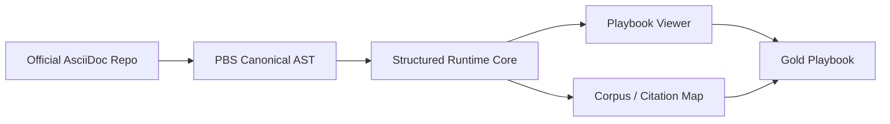
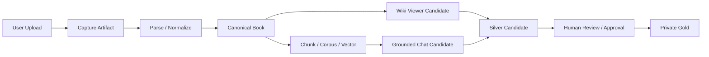

# Bronze / Silver / Gold Demo Memo

## 목적

내일 시연에서는 `문서를 업로드하면 PBS가 어떤 등급 사다리로 위키형 산출물을 만든다`를 눈으로 확인시키는 것이 핵심이다.

중요 포인트는 두 가지다.

1. `공식 OCP Gold`는 authority-grade Playbook 이다.
2. `유저 업로드`도 같은 viewer / corpus / chat surface 품질로 만들 수 있지만, 첫 승급 라벨은 `Silver Candidate`가 더 정확하다.

즉 내일 발표 메시지는 아래처럼 잡는 것이 가장 안전하다.

- `Gold = authority-grade final playbook`
- `Silver Candidate = user-upload wiki candidate`
- `Bronze = 수집/파싱/계보가 확보된 제작 중간물`

## 한 줄 서사

PBS는 문서를 저장하는 제품이 아니라, `이질적인 원천 문서를 위키 대백과 + grounded chat runtime`으로 제조하는 제품이다.

## 발표용 등급 사다리

| Grade | 의미 | 통과 조건 | 실패 시 | 대표 증거 |
|---|---|---|---|---|
| Bronze | 원천 문서를 수집하고 파서/계보를 고정한 제작 중간물 | capture 가능, parser route 기록, source fingerprint 존재, OCR/fallback 여부 기록 | blocked artifact 또는 재시도 | draft record, capture artifact, parser metadata |
| Silver Candidate | 사람이 읽을 수 있는 구조화 위키 후보 | canonical sections 생성, outline/anchor 가능, code/table/figure 최대 보존, corpus/chunk 생성 가능, boundary label 유지 | review-needed / blocked | canonical book, chunk corpus, private manifest |
| Gold | 최종 Playbook publish 가능 산출물 | source fidelity + chat interaction quality 동시 충족, precise citation landing, review approved, runtime publish 가능 | candidate 유지 | approved manifest, active playbook, chat citation evidence |

## 내부 상태와 발표용 라벨의 관계

계약상 내부 사다리는 아래다.

`bronze_raw -> bronze_parsed -> silver_structured -> gold_candidate -> wiki_runtime -> active_runtime`

내일 발표에서는 이것을 사람이 이해하기 쉬운 세 단계로 압축해도 된다.

- `Bronze`
  - `bronze_raw + bronze_parsed`
- `Silver Candidate`
  - `silver_structured + gold_candidate 직전의 위키 후보`
- `Gold`
  - `wiki_runtime + active_runtime publish 완료`

## 등급별 승급 조건

### 1. Bronze

정의:
- 업로드 또는 수집된 원천 문서가 PBS 안으로 들어왔고,
- 어떤 parser / fallback / OCR 경로를 탔는지 추적 가능한 상태

Pass 조건:
- `source_uri`, `source_type`, `capture_artifact_path` 존재
- `source_fingerprint`, `parser_backend`, `parser_version` 존재
- `ocr_used`, `fallback_used`, `degraded_reason` 같은 파싱 정황이 남아 있음

Fail 조건:
- capture만 있고 lineage 없음
- parser route 없음
- OCR/fallback 사용 여부가 비어 있음

대표 증거:
- draft record JSON
- captured source file

샘플:
- PDF 업로드 Bronze 샘플
  - [drafts/dtb-c705c4477784.json](/C:/Users/soulu/cywell/ocp-play-studio/ocp-play-studio/artifacts/customer_packs/drafts/dtb-c705c4477784.json)
  - [captures/dtb-c705c4477784/source.pdf](/C:/Users/soulu/cywell/ocp-play-studio/ocp-play-studio/artifacts/customer_packs/captures/dtb-c705c4477784/source.pdf)
- Markdown 업로드 Bronze 샘플
  - [drafts/dtb-2ca2a15f0a2a.json](/C:/Users/soulu/cywell/ocp-play-studio/ocp-play-studio/artifacts/customer_packs/drafts/dtb-2ca2a15f0a2a.json)
  - [captures/dtb-2ca2a15f0a2a/source.md](/C:/Users/soulu/cywell/ocp-play-studio/ocp-play-studio/artifacts/customer_packs/captures/dtb-2ca2a15f0a2a/source.md)

### 2. Silver Candidate

정의:
- 읽을 수 있는 위키 구조가 만들어졌고,
- outline / section / anchor / chunk 가 살아 있어 viewer + retrieval 후보로 쓸 수 있는 상태

Pass 조건:
- canonical book 생성 완료
- section 구조가 살아 있음
- code/table/procedure block collapse 없음
- chunk corpus 생성 가능 또는 완료
- customer/private lane이면 boundary label 유지

추가 권장 조건:
- `private_corpus_status = ready`
- `private_corpus_vector_status = ready`

Fail 조건:
- section heading만 있고 본문 붕괴
- code/table/procedure 단계 붕괴
- corpus가 library와 다른 truth를 가짐
- boundary label 없음

대표 증거:
- canonical book JSON
- chunks.jsonl
- vector/bm25 ready

샘플:
- PDF Silver Candidate 샘플
  - [books/dtb-c705c4477784.json](/C:/Users/soulu/cywell/ocp-play-studio/ocp-play-studio/artifacts/customer_packs/books/dtb-c705c4477784.json)
  - draft evidence:
    - `status = normalized`
    - `approval_state = approved`
    - `publication_state = draft`
    - `normalized_section_count = 20`
    - `private_corpus_status = ready`
    - `private_corpus_chunk_count = 118`
- Markdown Silver Candidate 샘플
  - [books/dtb-2ca2a15f0a2a.json](/C:/Users/soulu/cywell/ocp-play-studio/ocp-play-studio/artifacts/customer_packs/books/dtb-2ca2a15f0a2a.json)
  - draft evidence:
    - `normalized_section_count = 19`
    - `private_corpus_status = ready`
    - `private_corpus_chunk_count = 77`

발표에서의 권장 라벨:
- `Silver Candidate Wiki`
- `Private Silver Candidate`

### 3. Gold

정의:
- source fidelity와 chat interaction quality를 동시에 통과한 최종 Playbook

Pass 조건:
- reader-grade minimum 통과
- chat-grade minimum 통과
- citation이 book root가 아니라 정확한 anchor landing으로 감
- approved manifest에 올라감
- runtime publish 가능한 상태

핵심 품질 기준:
- 원문 절차 / 코드 / 표 / 그림 / 문맥 보존
- retrieval family hit
- anchor landing precision
- follow-up interaction 안정성
- library와 corpus가 같은 shared truth 사용

Fail 조건:
- 구조는 좋아도 grounding/citation이 불안정
- chat과 library truth 분리
- final winner selection 없이 candidate를 final surface에 그대로 노출

대표 증거:
- approved manifest
- gold playbook JSON
- active runtime viewer
- chat citation evidence

샘플:
- 공식 OCP Gold 샘플
  - [data/gold_manualbook_ko/playbooks/advanced_networking.json](/C:/Users/soulu/cywell/ocp-play-studio/ocp-play-studio/data/gold_manualbook_ko/playbooks/advanced_networking.json)
  - [manifests/ocp_ko_4_20_approved_ko.json](/C:/Users/soulu/cywell/ocp-play-studio/ocp-play-studio/manifests/ocp_ko_4_20_approved_ko.json)
- 현재 기준 증거
  - `approved_wiki_runtime_book_count = 29`
  - `advanced_networking`는 `approved_ko`, `section_count = 142`

## 내일 발표에서 강조할 제작 파이프라인

핵심 메시지:

`AsciiDoc 하나만 잘 읽는 제품`이 아니라, `여러 포맷을 위키형 산출물로 제조하는 엔진`임을 보여줘야 한다.

### A. Official OCP lane

설명 포인트:
- raw truth는 `repo/AsciiDoc first`
- markdown/html은 canonical truth가 아님
- viewer와 corpus가 같은 truth에서 자람
- Gold는 이 라인의 최종 산출물

### B. Customer / User Upload lane

설명 포인트:
- 업로드도 단순 file viewer가 아니라 `canonical book`으로 승격
- 그 canonical book에서 viewer와 corpus를 같이 파생
- 먼저 `Silver Candidate`로 확인
- 검토/승인 뒤 `Private Gold`로 올림

## 현재 customer upload 제작 파이프라인

### 구조가 좋은 텍스트 계열

- `md`
- `asciidoc`
- `txt`
- `web html`

기본 흐름:
- capture
- canonical sections 추출
- canonical book
- chunks / viewer / corpus

### 문서형 업로드

- `pdf`
- `docx`
- `pptx`
- `xlsx`

현재 구현 흐름:
- `MarkItDown` 우선
- 실패 또는 저품질이면 format별 fallback
- PDF는 `Docling -> Docling OCR -> pypdf -> pypdfium2 + RapidOCR`
- 원격 OCR 허용 시 `Surya` fallback

즉 발표에서는 이렇게 말하면 된다.

`PBS는 다양한 포맷을 받되, 각 포맷별 파싱/전처리/후처리 조합을 거쳐 최종적으로 같은 canonical wiki 구조로 수렴시킨다.`

## 내일 발표에서 바로 쓸 문장

### 추천 문장 1

`공식 문서는 Gold Playbook으로, 유저 업로드는 Silver Candidate Wiki로 먼저 올립니다. 중요한 건 두 경우 모두 같은 viewer와 grounded chat surface 품질로 수렴한다는 점입니다.`

### 추천 문장 2

`이 제품의 가치는 문서를 저장하는 데 있지 않고, PDF나 Markdown 같은 이질적인 입력을 위키 대백과형 산출물로 제조하는 제작 파이프라인에 있습니다.`

### 추천 문장 3

`Gold는 단순 번역본이 아니라, 원문 충실도와 챗봇 인용 정밀도를 동시에 통과한 최종 runtime 등급입니다.`

## 발표용 운영 원칙

- `공식 OCP = Gold`
- `유저 업로드 = Silver Candidate부터 시작`
- `등급은 장식이 아니라 승급 조건과 증거로 설명`
- `파이프라인 검증은 AsciiDoc 단일 예시보다 PDF/MD 업로드 예시를 함께 보여주는 편이 더 설득력 있음`

## 내일 보여주면 좋은 샘플 세트

1. `Official Gold`
   - `advanced_networking`
2. `PDF Silver Candidate`
   - `dtb-c705c4477784`
3. `Markdown Silver Candidate`
   - `dtb-2ca2a15f0a2a`
4. `Bronze raw capture`
   - `artifacts/customer_packs/captures/.../source.pdf` 또는 `source.md`

## 결론

내일 시연에서 제일 중요한 포인트는 이것이다.

`PBS는 AsciiDoc 전용 변환기가 아니라, 다양한 문서를 Bronze -> Silver Candidate -> Gold 사다리로 승격시키는 위키 제조 파이프라인이다.`
