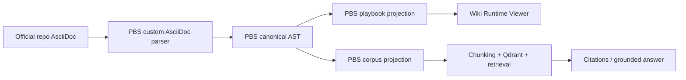

# Gold Playbook Technology Note

## 목적

이 문서는 `OpenShift Gold Playbook` 이 어떤 기술로 만들어지는지, 그리고 그중 무엇이 PBS 고유 구현인지와 무엇이 외부 오픈소스/인프라 의존성인지를 분리해서 설명한다.

핵심 질문은 세 가지다.

1. `Gold Playbook 본체`는 우리 알고리즘/구현인가?
2. 외부 라이브러리와 오픈소스는 어디에 쓰이는가?
3. `Docling / MarkItDown / OCR 계열`이 OCP Gold 본선에 필수인가?

## Executive Verdict

- `예, Gold Playbook의 본체는 PBS 고유 구현`이다.
- 다만 `완전 무의존 순수 단독 구현`은 아니다. Python 런타임, HTTP client, vector DB, graph DB, reranker, remote embedding/LLM endpoint 같은 외부 구성요소를 사용한다.
- 중요한 구분은 이것이다.
  - `OCP Gold 본선`: `AsciiDoc source -> PBS canonical AST -> PBS structured runtime -> PBS playbook/corpus/citation`
  - `업로드/복구 보조선`: `Docling`, `MarkItDown`, `RapidOCR`, `Surya`, `pypdf`, `pypdfium2`
- 따라서 서비스 가치 설명은 `오픈소스 parser로 문서를 예쁘게 변환했다`가 아니라, `공식 AsciiDoc를 PBS 고유 구조와 품질 게이트로 Playbook/Corpus/Chat runtime으로 투영한다`로 잡는 것이 맞다.

## Gold OCP Core Pipeline

## 1. PBS 고유 구현

### 1-1. AsciiDoc direct parse

공식 OCP Gold 라인의 핵심은 `AsciiDoc를 markdown으로 한 번 꺾지 않고` 바로 PBS 내부 구조로 바꾸는 것이다.

핵심 구현 파일:
- [src/play_book_studio/canonical/asciidoc.py](/C:/Users/soulu/cywell/ocp-play-studio/ocp-play-studio/src/play_book_studio/canonical/asciidoc.py)

여기서 PBS가 직접 하는 일:
- AsciiDoc source expand
- heading / anchor / admonition / code / table 해석
- section path 생성
- stable anchor 생성
- viewer path 연결
- semantic role 추론
- provenance 부착

즉 `OCP Gold`의 raw truth 해석은 `Docling`이나 `MarkItDown`이 아니라 PBS 코드가 담당한다.

### 1-2. Canonical AST 설계

PBS는 raw source를 단순 markdown으로 두지 않고 `canonical AST`라는 내부 표준 구조로 바꾼다.

핵심 구현 파일:
- [src/play_book_studio/canonical/models.py](/C:/Users/soulu/cywell/ocp-play-studio/ocp-play-studio/src/play_book_studio/canonical/models.py)

이 내부 구조가 담는 것:
- 문서 메타데이터
- provenance / source lineage
- section / anchor / path
- paragraph / prerequisite / procedure / code / note / table / anchor block
- translation / approval / publication 상태
- citation eligibility

이건 외부 표준 포맷이 아니라 `PBS가 설계한 내부 공통 구조`다.

### 1-3. Playbook projection

canonical AST를 사람이 읽는 `Gold Playbook 문서 구조`로 투영하는 로직도 PBS 구현이다.

핵심 구현 파일:
- [src/play_book_studio/canonical/project_playbook.py](/C:/Users/soulu/cywell/ocp-play-studio/ocp-play-studio/src/play_book_studio/canonical/project_playbook.py)
- [src/play_book_studio/ingestion/playbook_materialization.py](/C:/Users/soulu/cywell/ocp-play-studio/ocp-play-studio/src/play_book_studio/ingestion/playbook_materialization.py)

PBS가 직접 하는 일:
- canonical section -> playbook section artifact 투영
- anchor map 생성
- source metadata 유지
- code/table marker materialization
- quality status / quality flags 반영

### 1-4. Corpus projection and chunking

canonical AST를 retrieval/corpus용 평탄 구조와 chunk로 바꾸는 것도 PBS 구현이다.

핵심 구현 파일:
- [src/play_book_studio/canonical/project_corpus.py](/C:/Users/soulu/cywell/ocp-play-studio/ocp-play-studio/src/play_book_studio/canonical/project_corpus.py)
- [src/play_book_studio/ingestion/chunking.py](/C:/Users/soulu/cywell/ocp-play-studio/ocp-play-studio/src/play_book_studio/ingestion/chunking.py)

PBS가 직접 하는 일:
- section flattening
- block-aware text assembly
- semantic-role-aware chunk typing
- book별 chunk policy 적용
- chunk id 생성
- citation metadata 유지

즉 `코퍼스 생산 로직`의 핵심도 단순 외부 parser가 아니라 PBS가 가진 데이터 모델과 분할 정책이다.

### 1-5. Retrieval orchestration, scoring, citations

검색과 답변도 단순 “벡터 검색 한번”이 아니라 PBS 오케스트레이션 코드가 본체다.

핵심 구현 파일:
- [src/play_book_studio/answering/answerer.py](/C:/Users/soulu/cywell/ocp-play-studio/ocp-play-studio/src/play_book_studio/answering/answerer.py)
- [src/play_book_studio/retrieval/vector.py](/C:/Users/soulu/cywell/ocp-play-studio/ocp-play-studio/src/play_book_studio/retrieval/vector.py)
- [src/play_book_studio/retrieval/reranker.py](/C:/Users/soulu/cywell/ocp-play-studio/ocp-play-studio/src/play_book_studio/retrieval/reranker.py)
- [src/play_book_studio/retrieval/graph_runtime.py](/C:/Users/soulu/cywell/ocp-play-studio/ocp-play-studio/src/play_book_studio/retrieval/graph_runtime.py)
- [src/play_book_studio/answering/citations.py](/C:/Users/soulu/cywell/ocp-play-studio/ocp-play-studio/src/play_book_studio/answering/citations.py)

PBS가 직접 하는 일:
- hybrid retrieval orchestration
- query intent routing
- rerank integration
- graph fallback/runtime mode 선택
- citation selection / citation injection
- answer shaping
- runtime boundary discipline

## 2. 외부 오픈소스 / 라이브러리 / 인프라

PBS는 `zero dependency` 제품은 아니다. 아래 외부 구성요소를 쓴다.

### 2-1. Python package dependencies

파일:
- [pyproject.toml](/C:/Users/soulu/cywell/ocp-play-studio/ocp-play-studio/pyproject.toml)

주요 항목:
- `requests`
  - embedding, qdrant, llm, runtime probe 등 HTTP 호출
- `beautifulsoup4`
  - HTML 계열 정리/정규화 보조
- `sentence-transformers`
  - cross-encoder reranker
- `neo4j`
  - graph backend driver
- `networkx`
  - graph data handling 보조
- `jsonschema`
  - payload/schema 검증

### 2-2. External runtime infrastructure

- `Remote embedding endpoint`
  - 현재 운영은 `TEI-compatible embedding service`
  - 구현 클라이언트: [src/play_book_studio/ingestion/embedding.py](/C:/Users/soulu/cywell/ocp-play-studio/ocp-play-studio/src/play_book_studio/ingestion/embedding.py)
- `Qdrant`
  - vector store
  - 구현 연결: [src/play_book_studio/retrieval/vector.py](/C:/Users/soulu/cywell/ocp-play-studio/ocp-play-studio/src/play_book_studio/retrieval/vector.py), [src/play_book_studio/ingestion/qdrant_store.py](/C:/Users/soulu/cywell/ocp-play-studio/ocp-play-studio/src/play_book_studio/ingestion/qdrant_store.py)
- `Neo4j`
  - optional graph backend
  - 구현 연결: [src/play_book_studio/retrieval/graph_runtime.py](/C:/Users/soulu/cywell/ocp-play-studio/ocp-play-studio/src/play_book_studio/retrieval/graph_runtime.py)
- `OpenAI-compatible LLM endpoint`
  - grounded answer 생성
  - 구현 연결: [src/play_book_studio/answering/llm.py](/C:/Users/soulu/cywell/ocp-play-studio/ocp-play-studio/src/play_book_studio/answering/llm.py)

## 3. OCP Gold 본선에 본질적이지 않은 도구

아래 도구들은 `OCP Gold 본선`의 핵심 가치가 아니다. customer/private upload 또는 fallback 복구선 쪽 도구다.

### 3-1. Docling

역할:
- PDF / image -> markdown
- OCR 포함 fallback path

파일:
- [src/play_book_studio/intake/normalization/pdf.py](/C:/Users/soulu/cywell/ocp-play-studio/ocp-play-studio/src/play_book_studio/intake/normalization/pdf.py)
- [src/play_book_studio/intake/normalization/builders.py](/C:/Users/soulu/cywell/ocp-play-studio/ocp-play-studio/src/play_book_studio/intake/normalization/builders.py)

판정:
- `customer/private upload lane`에는 의미가 있음
- `OCP official AsciiDoc Gold 본선`에는 필수가 아님

### 3-2. MarkItDown

역할:
- 범용 문서 -> markdown/text 변환

파일:
- [src/play_book_studio/intake/normalization/markitdown_adapter.py](/C:/Users/soulu/cywell/ocp-play-studio/ocp-play-studio/src/play_book_studio/intake/normalization/markitdown_adapter.py)

판정:
- `customer upload lane`에서만 의미가 있을 수 있음
- `AsciiDoc official lane`에는 필요 없음

### 3-3. pypdf / pypdfium2 / RapidOCR / Surya

역할:
- `pypdf`: PDF text + outline fallback
- `pypdfium2`: PDF render fallback
- `RapidOCR`: local OCR fallback
- `Surya`: remote OCR fallback

파일:
- [src/play_book_studio/intake/normalization/pdf.py](/C:/Users/soulu/cywell/ocp-play-studio/ocp-play-studio/src/play_book_studio/intake/normalization/pdf.py)
- [src/play_book_studio/intake/normalization/surya_adapter.py](/C:/Users/soulu/cywell/ocp-play-studio/ocp-play-studio/src/play_book_studio/intake/normalization/surya_adapter.py)
- [src/play_book_studio/intake/normalization/degraded_pdf.py](/C:/Users/soulu/cywell/ocp-play-studio/ocp-play-studio/src/play_book_studio/intake/normalization/degraded_pdf.py)

판정:
- `customer/private upload PDF 복구선`에는 실제 의미가 있음
- `OCP Gold 본선`에는 본질 요소가 아님

OCR fallback priority:
- `RapidOCR first`
- `Surya second`

### 3-4. Marker

역할:
- 현재는 `의도만 남은 stub`

판정:
- adapter slot만 이름으로 남아 있고
- 실제 adapter 파일/설치/운영 사용이 없다
- 따라서 현시점 서비스 가치 설명에서 핵심 기술로 올릴 대상이 아니다

## 4. 기술 가치 문장

서비스 가치 설명은 아래처럼 가는 것이 맞다.

### 나쁜 설명

- `우리는 Docling이나 MarkItDown으로 문서를 변환합니다`
- `우리는 여러 오픈소스 parser를 조합해 플레이북을 만듭니다`

이 설명은 PBS의 고유 가치를 너무 약하게 보이게 만든다.

### 좋은 설명

- `PBS는 공식 AsciiDoc 원천소스를 자체 canonical AST로 직접 구조화한다`
- `그 canonical 구조에서 Playbook 문서, Corpus chunk, Citation path를 같은 truth 위에서 동시에 파생한다`
- `외부 오픈소스는 업로드 문서 복구나 인프라 계층에서 쓰되, Gold Playbook의 핵심 품질은 PBS 고유 데이터 모델과 투영 알고리즘에서 나온다`

## 5. 최종 결론

짧게 정리하면 이렇다.

- `Gold Playbook의 본체`는 PBS 고유 구현이다
- `외부 라이브러리/오픈소스`는 인프라 또는 upload/fallback 보조 계층에 가깝다
- `Docling / MarkItDown / OCR 계열`은 OCP Gold 핵심 가치의 중심축이 아니다
- 서비스 가치 문서는 `AsciiDoc direct parse -> canonical AST -> playbook/corpus/citation`를 중심으로 써야 한다
