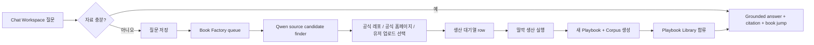

# PBS Book Factory Product Note

## 목적

이 문서는 PBS를 `평범한 RAG 챗봇`이 아니라 `문서를 수집하고, 위키형 책과 코퍼스를 같이 생산하는 제품`으로 설명하기 위한 현재 고정 메모다.

이 문서는 세 가지를 분리해서 고정한다.

1. `지금 사실`
2. `목표 상태`
3. `내일 시연 acceptance`

핵심은 과장 없이 말하는 것이다.

- 현재 live Gold pack의 provenance는 `hybrid`다.
- 하지만 제품 doctrine은 `official repo/AsciiDoc first`를 지향한다.
- PBS의 본질 가치는 `chatbot`이 아니라 `Book Factory + Library + Viewer + grounded chat`가 한 진실선 위에 묶인다는 점이다.

## 한 줄 정의

PBS는 문서를 저장하는 제품이 아니라, `공식 문서와 유저 문서를 위키형 책 + grounded chat corpus로 제조하는 Book Factory`다.

## 현재 사실

### 1. 현재 live Gold pack provenance

현재 live approved pack은 `하나의 순수 repo-first pack`이 아니다.

- `공식 KO published html-single` 기반 책이 다수다
- `repo/source-first`로 실제 생산된 책도 일부 존재한다
- 즉 현재 live pack은 `hybrid provenance` 상태다

이 사실은 발표나 내부 공유에서 숨기지 않는다.

### 2. repo/source-first 라인은 실제로 존재한다

PBS 안에는 실제로 아래 라인이 있다.

- `official repo AsciiDoc`
- `source_repo bind`
- `direct parse`
- 필요 시 `번역`
- `playbook + corpus + citation runtime`

즉 repo-first doctrine 자체는 가짜가 아니다.
다만 현재 live pack의 majority provenance가 그것으로 완전히 재구축된 상태는 아직 아니다.

### 3. 현재 제품 surface

PBS의 실제 제품 경험은 아래 네 개로 보는 것이 맞다.

1. `Playbook Library`
2. `Wiki Runtime Viewer`
3. `Chat Workspace`
4. `Book Factory`

현재 `Repository` 페이지는 앞으로 `Book Factory` 역할을 맡는 것이 자연스럽다.

### 4. 현재 Qwen의 위치

Qwen 3.5 9B는 단순 챗봇용이 아니라 `Book Factory 내부 보조 LLM`으로 쓰는 것이 맞다.

현재/예정 역할:

- 질문이 답변 불가인지 판별 보조
- 원천소스 후보 찾기 보조
- source candidate 정리
- 필요 시 translation/judge 보조

즉 `LLM = 채팅`이 아니라 `LLM = 공장 보조 오케스트레이터`다.

## 목표 상태

목표 상태는 아래 루프가 한 제품 안에서 닫히는 것이다.

## 왜 이게 PBS의 핵심 가치인가

보통 RAG 시스템은 이미 있는 문서에 답변을 붙인다.

PBS는 그보다 앞단을 다룬다.

- 어떤 문서가 필요한지 포착하고
- 원천소스를 찾고
- 위키형 책으로 생산하고
- 코퍼스를 같이 만들고
- 그 결과를 챗봇과 연결한다

즉 PBS는 `답변기`가 아니라 `문서 제조-출판-대화 시스템`이다.

## 원천소스 3대 lane

### 1. 공식 레포 lane

입력:
- `GitHub official repo`
- `AsciiDoc source`

행위:
- repo path bind
- direct parse
- 필요 시 번역
- playbook/corpus/citation runtime 생성

의미:
- 구조 품질
- 재현성
- provenance 설명력

발표 메시지:
- `원천소스가 GitHub 레포지토리인 공식 문서를 그대로 가져와 생산할 수 있다`

### 2. 공식 홈페이지 lane

입력:
- `docs.redhat.com 같은 공식 published manual`

행위:
- published manual capture
- parse/normalize
- playbook/corpus/citation runtime 생성

의미:
- 이미 검수된 한국어 표현
- reader-facing 품질
- 번역 benchmark

발표 메시지:
- `공식 홈페이지의 검수된 문서를 기준으로 바로 생산할 수 있다`

### 3. 유저 업로드 lane

입력:
- `pdf`
- `docx`
- `pptx`
- `xlsx`
- `markdown`
- 기타 private 자료

행위:
- normalize
- wiki형 구조화
- private corpus 생성
- boundary-labeled library 합류

의미:
- 고객 내부 문서도 같은 viewer/chat surface에 태울 수 있다

발표 메시지:
- `공식 문서뿐 아니라 고객의 자체 문서도 같은 공장으로 책으로 만든다`

## Book Factory 정의

Book Factory는 `질문 회수`, `원천소스 후보 관리`, `생산 대기열`, `생산 실행`, `산출물 합류`를 담당하는 면이다.

앞으로 Book Factory가 맡아야 하는 기능은 아래다.

1. 챗봇이 답변하기 어려운 질문 저장
2. 저장된 질문 목록 표시
3. Qwen이 source candidate 추천
4. source candidate를 대기열 row로 표기
5. row에서 `딸깍 생산`
6. 생산된 책이 Playbook Library에 합류
7. 유저 업로드도 같은 공장 안에서 취급

즉 `현재 Repository 페이지`는 단순 검색면이 아니라 `생산 공장`으로 승격된다.

## 책과 코퍼스의 관계

PBS는 `책 먼저, 코퍼스 나중`도 아니고 `코퍼스 먼저, 책 나중`도 아니다.

한 원천소스에서 아래 둘을 같이 만든다.

- 사람이 읽는 `Playbook`
- 챗봇이 쓰는 `Corpus`

그래서 PBS는 아래를 약속해야 한다.

- 책과 챗봇이 같은 진실선에서 나온다
- citation은 책의 정확한 절/앵커로 떨어진다
- 책이 바뀌면 코퍼스도 같이 갱신된다

## Source basis 표기 규칙

앞으로 모든 책은 원천소스를 숨기지 않는다.

최소 표기는 아래 셋이다.

- `공식 레포 기준`
- `공식 홈페이지 기준`
- `유저 업로드 기준`

가능하면 각 책에는 source option popover로 아래 둘 이상이 같이 보여야 한다.

- 현재 생성 기준
- 대체 생산 가능 기준

예:
- `공식 홈페이지`
- `공식 레포`

## 번역 원칙

공식 문서 lane에서 영어 본문이 발견되면 기본 행동은 `제거`가 아니라 `번역 완료`다.

다만 번역은 모델 감으로만 두지 않는다.

필요한 것:

- `OCP 전용 고유명사 꾸러미`
- `preferred terminology pack`
- 공식 KO benchmark 기반 표현 고정

예:

- `Hosted control planes -> 호스팅된 컨트롤 플레인`
- `control plane -> 컨트롤 플레인`

즉 PBS는 `모델이 적당히 번역한 한국어`가 아니라 `공식 용어를 따르는 reader-grade 한국어`를 목표로 한다.

## Judge의 위치

Landing page에 있는 `Bronze -> Silver -> Gold -> Judge`는 release gate 관점에서 설명하는 것이 맞다.

이때 Judge는 `LLM 혼자 감정`이 아니다.

Judge는 아래를 함께 보는 gate다.

- 구조 품질
- citation landing
- source fidelity evidence
- terminology consistency
- 필요 시 LLM 평가 보조

즉 Judge는 `증거 기반 release gate`다.

## 내일 시연에서 보여줘야 하는 루프

내일 시연에서 가장 설득력 있는 루프는 아래다.

1. `Playbook Library`에서 기존 책을 보여준다
2. `Chat Workspace`에서 질문을 던진다
3. 챗봇이 답변하거나, 자료 부족 질문은 저장하게 안내한다
4. 저장된 질문이 `Book Factory`에 뜬다
5. Book Factory의 Qwen이 원천소스 후보를 제안한다
6. `공식 레포` 또는 `공식 홈페이지`를 고른다
7. `딸깍 생산`한다
8. `31번째 책`이 Library에 합류한다
9. 새 책과 연결된 grounded chat까지 확인한다

이 데모가 성공하면 PBS의 가치는 `RAG 성능`이 아니라 `지식 생산 시스템`으로 보이게 된다.

## 내일 acceptance criteria

### Pass

아래 6개가 모두 보이면 성공이다.

1. 질문 저장이 된다
2. 저장된 질문이 Book Factory에 보인다
3. source candidate가 최소 1개 이상 붙는다
4. source basis가 명시된다
5. 단권 생산이 실행된다
6. 생산된 책이 Library 리스트에 합류한다

### Evidence

최소 증거는 아래다.

- 저장된 질문 row
- source candidate row
- 생산 실행 로그
- 새 책이 보이는 Library 카드
- viewer에서 책이 열리는 장면
- chat citation이 새 책으로 떨어지는 장면

### Fail

아래 중 하나라도 발생하면 데모 루프는 실패다.

- 질문 저장은 되지만 공장으로 안 넘어감
- 공장에서 source candidate가 안 보임
- 생산 실행은 되지만 리스트 반영이 안 됨
- 책은 생겼는데 corpus/citation이 연결 안 됨
- source basis가 안 보여 provenance를 설명 못 함

## 하지 않을 것

- PBS를 `그냥 챗봇`으로 설명하지 않는다
- provenance를 뭉개서 말하지 않는다
- `모든 live Gold가 repo-first`라고 말하지 않는다
- source basis를 숨긴 채 완성품처럼 포장하지 않는다
- temporary demo fork를 delivery path로 쓰지 않는다

## 한 줄 결론

PBS의 핵심 가치는 `문서를 읽어주는 RAG`가 아니라, `필요한 문서를 찾아 수집하고, 위키형 책과 코퍼스로 생산해, 다시 챗봇과 연결하는 Book Factory 시스템`이라는 데 있다.
